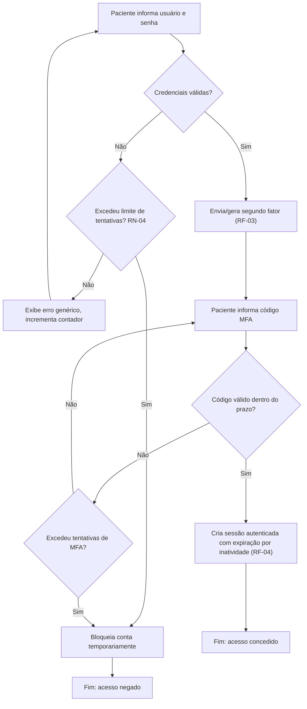
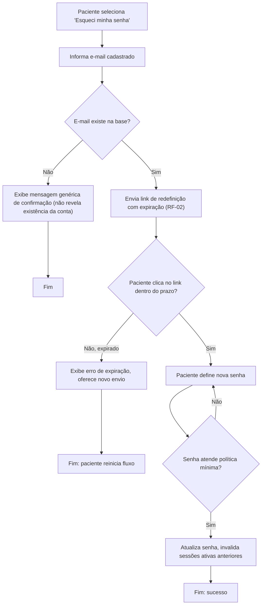
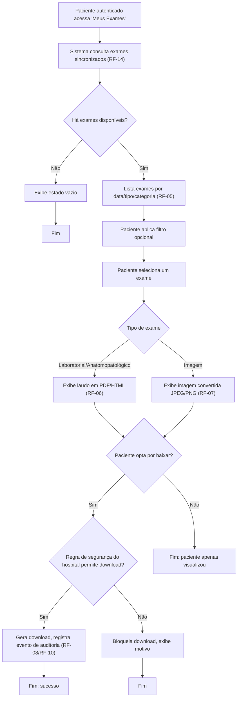
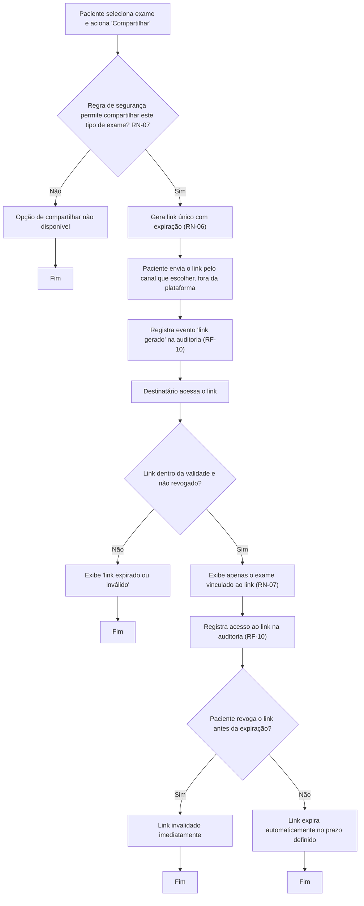
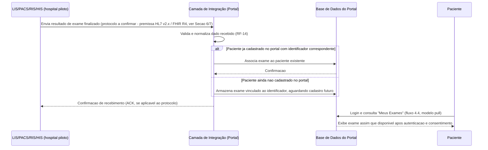

# PRD-TECNICO.md — Portal de Resultados de Exames (Aplicação White Label para Hospitais)

**Dono**: Business Analyst
**Data**: 2026-09-02
**Status**: Pronto para o Software Architect (checklist de Critérios de Pronto ao
final deste documento — todos os itens verificados)
**Input**: `PRD.md` (liberado pelo PM, `stakeholder-alignment-check` limpo,
2026-09-02) + `CTO-REVIEW.md` (Gate 1, Aprovado com ressalvas, 2026-09-02)

> Este documento eleva o `PRD.md` ao nível de detalhe que o Software Architect
> precisa para desenhar a solução sem reinterpretar intenção de negócio. O núcleo do
> detalhamento cobre os itens **Must-have** da Seção 5 do `PRD.md` (Release 1 —
> hospital piloto). Itens **Should/Could** recebem detalhamento leve, sinalizados
> como Release 2+, e não bloqueiam a liberação deste documento. Itens **Won't** são
> mencionados apenas onde necessário para justificar uma regra de negócio (ex.:
> proibição de anexo de e-mail).
>
> Toda ambiguidade do `PRD.md` resolvida pelo BA está registrada na **Seção 7**, com
> a interpretação escolhida e o porquê. Nenhuma delas altera escopo ou objetivo de
> negócio — quando uma pergunta em aberto do `PRD.md` (Seção 7) tocava esse tipo de
> decisão, isso não ocorreu neste caso (ver Seção 6): todas as premissas herdadas do
> PM puderam ser resolvidas dentro da autoridade do BA (interpretação de detalhe) ou
> permanecem como pendência formal ligada à Premissa P1 (hospital piloto ainda não
> identificado), sem bloquear a produção deste documento — conforme orientação
> explícita do PM/CTO de que P1 não deve travar o BA.

---

## 1. Requisitos Funcionais

### 1.1 Convenções

- Cada requisito funcional (RF) tem um identificador único, a origem no `PRD.md`
  (Seção 5), e critério de aceite em formato EARS (`WHEN {gatilho} GIVEN
  {pré-condição} THE SYSTEM SHALL {comportamento}`).
- Todo caso de exceção mapeado vira um critério de aceite próprio.
- Onde um parâmetro numérico (prazo, limite de tentativas) não está confirmado no
  `PRD.md` nem pelo stakeholder, o critério registra o comportamento (testável) e
  marca o valor exato como **"a confirmar"**, eventualmente com um valor sugerido
  pelo BA entre colchetes — nunca tratado como fato confirmado. Ver Seção 7 para o
  racional de cada valor sugerido.
- Requisitos **Must-have** (núcleo do MVP/piloto) recebem detalhamento completo.
  Requisitos **Should/Could** (Release 2+) recebem um critério de aceite de alto
  nível único, sem exceções detalhadas — aprofundamento fica para quando forem
  priorizados.

### 1.2 Requisitos Funcionais Must-have (Release 1 — núcleo do MVP)

#### RF-01 — Autenticação por usuário e senha
Origem: PRD Seção 5, "Login usuário/senha + sessão com expiração" (Must).

Como **paciente cadastrado**, eu quero **autenticar-me com usuário e senha**, para
que **eu acesse com segurança meus próprios resultados de exame**.

Critérios de aceite:
- WHEN o paciente informa e-mail/CPF e senha cadastrados corretamente GIVEN a conta
  está ativa THE SYSTEM SHALL validar as credenciais e avançar para a etapa de MFA
  (RF-03) antes de conceder acesso.
- WHEN o paciente informa credenciais inválidas GIVEN a conta existe THE SYSTEM
  SHALL rejeitar o acesso e exibir mensagem genérica de erro, sem indicar se o
  usuário ou a senha está incorreta (mitigação de enumeração de conta).
- WHEN o número de tentativas malsucedidas consecutivas atinge o limite definido
  (a confirmar — valor sugerido pelo BA: 5 tentativas, ver Seção 7) THE SYSTEM SHALL
  bloquear temporariamente a conta (RN-04) e informar o paciente sobre o
  procedimento de desbloqueio.
- WHEN o paciente tenta autenticar em uma conta ainda não confirmada/sem consentimento
  LGPD registrado (RF-15 incompleto) THE SYSTEM SHALL impedir o login e direcionar
  para a conclusão do cadastro.

#### RF-02 — Recuperação de senha por e-mail
Origem: PRD Seção 5, "Recuperação de senha por e-mail" (Must).

Como **paciente**, eu quero **redefinir minha senha via e-mail cadastrado**, para
que **eu recupere acesso sem depender de suporte humano**.

Critérios de aceite:
- WHEN o paciente solicita "esqueci minha senha" e informa um e-mail GIVEN o e-mail
  existe na base THE SYSTEM SHALL enviar um link de redefinição de senha com
  expiração (a confirmar — valor sugerido pelo BA: 30 minutos, ver Seção 7).
- WHEN o paciente solicita "esqueci minha senha" com um e-mail que não existe na
  base THE SYSTEM SHALL exibir a mesma mensagem genérica de confirmação de envio,
  sem revelar se o e-mail está cadastrado (mitigação de enumeração de conta).
- WHEN o paciente acessa o link de redefinição após o prazo de expiração THE SYSTEM
  SHALL rejeitar o link, exibir mensagem de expiração e oferecer novo envio.
- WHEN a nova senha é definida com sucesso THE SYSTEM SHALL invalidar todas as
  sessões ativas anteriores daquela conta.

#### RF-03 — Autenticação multifator (MFA) — Must-have elevado (R3, LGPD)
Origem: PRD Seção 5, "MFA" — elevado de opcional para Must (ressalva R3 do Gate 1).

Como **paciente**, eu quero **confirmar minha identidade com um segundo fator após
usuário/senha**, para que **dados de saúde sensíveis fiquem protegidos mesmo se
minha senha for comprometida**.

Critérios de aceite:
- WHEN o primeiro fator (usuário/senha, RF-01) é validado com sucesso THE SYSTEM
  SHALL exigir obrigatoriamente um segundo fator antes de conceder acesso — sem
  opção de pular ou desativar o MFA (RN-03).
- WHEN o segundo fator é solicitado THE SYSTEM SHALL enviar/gerar um código válido
  por um período limitado (a confirmar — valor sugerido pelo BA: 5 minutos para
  código enviado por e-mail; 30 segundos por ciclo se TOTP, ver Seção 7 sobre o
  método escolhido para o MVP).
- WHEN o paciente informa o código MFA correto dentro do prazo THE SYSTEM SHALL
  conceder acesso e criar a sessão autenticada (RF-04).
- WHEN o paciente informa o código MFA incorreto ou expirado THE SYSTEM SHALL
  rejeitar o acesso, permitir reenvio de um novo código, e contar a tentativa para
  o mesmo limite de bloqueio de RF-01/RN-04.
- WHEN o paciente perde o acesso ao segundo fator (ex.: troca de celular/e-mail
  indisponível) THE SYSTEM SHALL oferecer um caminho de recuperação assistida via
  suporte técnico do piloto (RF-16), com verificação manual de identidade — não há
  self-service de reset de MFA no MVP (Release 2+).

#### RF-04 — Sessão com expiração automática
Origem: PRD Seção 5, "sessão com expiração" (Must, parte do item de login).

Como **paciente**, eu quero **que minha sessão expire automaticamente após
inatividade**, para que **meus dados fiquem protegidos se eu esquecer de sair do
portal em um dispositivo compartilhado**.

Critérios de aceite:
- WHEN o paciente fica inativo por um período definido (a confirmar — valor
  sugerido pelo BA: 15 minutos, dado o caráter sensível do dado de saúde, ver Seção
  7) THE SYSTEM SHALL encerrar a sessão automaticamente e exigir nova autenticação
  completa (RF-01 + RF-03).
- WHEN o paciente encerra a sessão manualmente ("sair") THE SYSTEM SHALL invalidar
  o token de sessão imediatamente, mesmo antes do prazo de expiração por
  inatividade.

#### RF-05 — Listagem de exames por data/tipo/categoria
Origem: PRD Seção 5, "Lista de exames por data/tipo" + "Filtros por categoria"
(ambos Must).

Como **paciente autenticado**, eu quero **ver a lista dos meus exames organizada
por data, tipo e categoria, com filtros**, para que **eu encontre rapidamente o
resultado que procuro**.

Critérios de aceite:
- WHEN o paciente acessa "Meus Exames" GIVEN existem exames sincronizados via
  integração (RF-14) associados ao seu cadastro THE SYSTEM SHALL exibir a lista
  ordenada por data (mais recente primeiro), com tipo e categoria visíveis.
- WHEN não há nenhum exame disponível para o paciente THE SYSTEM SHALL exibir um
  estado vazio explicativo, não um erro.
- WHEN o paciente aplica um filtro por categoria (laboratorial, anatomopatológico,
  imagem) THE SYSTEM SHALL exibir somente os exames daquela categoria.
- WHEN o paciente aplica um filtro que não retorna nenhum resultado THE SYSTEM
  SHALL exibir mensagem de "nenhum exame encontrado para este filtro", mantendo o
  filtro visível para ajuste.

#### RF-06 — Exibição de laudo em PDF/HTML
Origem: PRD Seção 5, "Laudo em PDF/HTML" (Must).

Como **paciente**, eu quero **visualizar o laudo de um exame laboratorial ou
anatomopatológico diretamente no portal**, para que **eu não precise de software
externo para ler meu resultado**.

Critérios de aceite:
- WHEN o paciente seleciona um exame do tipo laboratorial/anatomopatológico GIVEN
  o laudo já foi recebido pela integração (RF-14) THE SYSTEM SHALL exibir o
  conteúdo em PDF ou HTML dentro do portal, sem exigir download prévio.
- WHEN o exame selecionado ainda não teve o laudo processado/recebido (resultado
  pendente no LIS) THE SYSTEM SHALL exibir status "resultado em processamento", não
  um erro genérico.
- WHEN a renderização do laudo falha (arquivo corrompido/formato inesperado) THE
  SYSTEM SHALL exibir mensagem de erro específica e registrar o incidente para
  monitoramento (RNF-10), sem expor detalhes técnicos ao paciente.

#### RF-07 — Exibição de imagem de exame (JPEG/PNG convertido)
Origem: PRD Seção 5, "Imagem convertida JPEG/PNG" (Must). DICOM nativo é Should,
Release 2 (RF-S02).

Como **paciente**, eu quero **visualizar a imagem do meu exame de imagem
(radiologia) em formato convertido**, para que **eu consiga ver o resultado sem
precisar de um visualizador DICOM especializado**.

Critérios de aceite:
- WHEN o paciente seleciona um exame de imagem GIVEN a imagem já foi convertida de
  DICOM para JPEG/PNG pela camada de integração (RF-14) THE SYSTEM SHALL exibir a
  imagem convertida dentro do portal.
- WHEN o exame de imagem ainda não teve a conversão concluída THE SYSTEM SHALL
  exibir status "imagem em processamento".
- WHEN a conversão DICOM → JPEG/PNG falha THE SYSTEM SHALL registrar o incidente
  (RNF-10) e notificar a equipe de suporte técnico do piloto (RF-16), sem bloquear
  o restante da lista de exames do paciente.

#### RF-08 — Download de laudo/imagem
Origem: PRD Seção 5, "Download de laudo/imagem" (Must).

Como **paciente**, eu quero **baixar o laudo ou a imagem do meu exame**, para que
**eu tenha uma cópia local ou possa entregá-la fisicamente/por outro canal quando
necessário**.

Critérios de aceite:
- WHEN o paciente aciona "baixar" em um exame exibido (RF-06/RF-07) GIVEN a regra
  de segurança do hospital permite download para aquele tipo de exame (RN, Seção 3)
  THE SYSTEM SHALL gerar o arquivo para download e registrar o evento no histórico
  de auditoria (RF-10).
- WHEN a regra de segurança do hospital não permite download para aquele tipo de
  exame/categoria THE SYSTEM SHALL ocultar ou desabilitar a opção de download,
  exibindo o motivo de forma resumida.

#### RF-09 — Compartilhamento por link temporário com expiração
Origem: PRD Seção 5, "Compartilhamento por link temporário com expiração" (Must).
Substitui compartilhamento por anexo de e-mail, cortado como **Won't** (R3, risco
LGPD).

Como **paciente**, eu quero **gerar um link temporário para compartilhar um exame
específico com terceiros (ex.: outro médico)**, para que **eu compartilhe meu
resultado sem expor o arquivo de forma permanente e sem controle de acesso, como
ocorreria com anexo de e-mail**.

Critérios de aceite:
- WHEN o paciente aciona "compartilhar" em um exame GIVEN a regra de segurança do
  hospital permite compartilhamento daquele tipo de exame (RN-07) THE SYSTEM SHALL
  gerar um link único, com token de acesso e expiração definida (RN-06).
- WHEN o link é gerado THE SYSTEM SHALL registrar o evento "link gerado" no
  histórico de auditoria do paciente (RF-10), incluindo data/hora.
- WHEN um destinatário acessa o link dentro do prazo de validade e o link não foi
  revogado THE SYSTEM SHALL exibir **apenas** o(s) exame(s) vinculado(s) àquele
  link — nunca a conta completa do paciente ou outros exames (RN-07).
- WHEN um destinatário acessa o link após a expiração, ou o link foi revogado pelo
  paciente THE SYSTEM SHALL exibir mensagem "link expirado ou inválido", sem
  qualquer dado do exame.
- WHEN o paciente aciona "revogar link" antes da expiração THE SYSTEM SHALL
  invalidar o link imediatamente, mesmo que ainda dentro do prazo original.
- WHEN qualquer acesso ao link (bem-sucedido ou expirado) ocorre THE SYSTEM SHALL
  registrar data/hora e, quando tecnicamente disponível, IP de origem, no histórico
  de auditoria (RF-10).
- WHEN o paciente tenta compartilhar por anexo de e-mail direto THE SYSTEM SHALL
  não oferecer essa opção — funcionalidade deliberadamente ausente (Won't, R3;
  RN-05).

#### RF-10 — Histórico de acessos/downloads (auditoria)
Origem: PRD Seção 5, "Histórico de acessos/downloads (auditoria)" (Must, exigência
de rigor LGPD — R3).

Como **paciente**, eu quero **ver o histórico de quando meus exames foram
acessados, baixados ou compartilhados**, para que **eu tenha transparência e
controle sobre quem viu meus dados de saúde**; como **hospital (via administrador
operacional)**, eu quero **auditar os mesmos eventos**, para que **eu comprove
conformidade LGPD em caso de fiscalização**.

Critérios de aceite:
- WHEN qualquer evento de visualização, download, geração de link, acesso via link
  ou revogação de link ocorre (RF-06 a RF-09) THE SYSTEM SHALL registrar o evento
  de forma imutável, com identificador do exame, tipo de evento, data/hora e ator
  (paciente autenticado ou acesso via link).
- WHEN o paciente acessa "Meu Histórico" THE SYSTEM SHALL exibir os eventos
  relacionados à sua própria conta, ordenados cronologicamente.
- WHEN o administrador operacional do hospital acessa o painel de auditoria GIVEN
  possui permissão RBAC correspondente THE SYSTEM SHALL exibir os eventos de
  auditoria do hospital, sem expor dados de auditoria de outro hospital (RNF-11).
- WHEN um evento de auditoria é gerado THE SYSTEM SHALL impedir sua edição ou
  exclusão por qualquer usuário, incluindo administradores (log imutável/append-only)
  — retenção exata a confirmar (RNF-04).

#### RF-11 — Identidade visual do hospital piloto aplicada (não self-service)
Origem: PRD Seção 5, "Identidade visual aplicada (não self-service)" (Must). Painel
self-service é Could/Release 2+ (RF-C01).

Como **paciente do hospital piloto**, eu quero **ver o portal com a marca do meu
hospital (logo, cores, nome)**, para que **eu reconheça o canal como
institucional/confiável**, e não como um sistema genérico de terceiro.

Critérios de aceite:
- WHEN o portal é acessado por um paciente do hospital piloto THE SYSTEM SHALL
  exibir logo, paleta de cores e nome institucional configurados para aquele
  hospital.
- WHEN a equipe interna do projeto atualiza um ativo de identidade visual (logo,
  cor) THE SYSTEM SHALL refletir a mudança sem exigir alteração de código-fonte da
  lógica de negócio (configuração, não hardcode) — decisão de como implementar essa
  configuração cabe ao Software Architect (Premissa P9).
- WHEN não há painel administrativo self-service no MVP THE SYSTEM SHALL depender
  de configuração feita pela equipe interna do projeto antes do go-live do piloto
  — nenhuma expectativa de autoatendimento de marca pelo hospital nesta release.

#### RF-12 — Textos institucionais obrigatórios e consentimento LGPD
Origem: PRD Seção 5, "Textos institucionais (termos, privacidade)" (Must, exigência
legal).

Como **paciente**, eu quero **ler os termos de uso e a política de privacidade, e
dar consentimento específico para o tratamento do meu dado de saúde**, para que
**eu saiba como meus dados serão usados antes de aceitar** (LGPD Art. 11 — dado
sensível exige consentimento específico e destacado, ou outra base legal do rol
taxativo do Art. 11, II).

Critérios de aceite:
- WHEN o paciente inicia o cadastro (RF-15) THE SYSTEM SHALL exibir Termos de Uso
  e Política de Privacidade antes de qualquer coleta de dado de saúde.
- WHEN o paciente avança no cadastro THE SYSTEM SHALL exigir consentimento
  específico e destacado para o tratamento de dado de saúde (checkbox separado do
  aceite geral dos Termos de Uso — não pode ser um único aceite genérico, conforme
  Art. 11, I da LGPD; ver evidência na Seção 6).
- WHEN o paciente não marca o consentimento específico de dado de saúde THE SYSTEM
  SHALL impedir a conclusão do cadastro (RN-02).
- WHEN o consentimento é registrado THE SYSTEM SHALL armazenar versão do texto
  aceito, data/hora e identificação do titular, de forma auditável e recuperável
  (suporte a comprovação em caso de fiscalização).
- WHEN os Termos de Uso ou a Política de Privacidade são atualizados pela equipe
  interna THE SYSTEM SHALL exigir novo aceite do paciente no próximo login antes de
  liberar acesso à área logada.

#### RF-13 — Gestão básica de usuários (administrador operacional do hospital)
Origem: PRD Seção 5, "Gestão básica de usuários" (Must).

Como **administrador operacional do hospital**, eu quero **gerenciar contas de
pacientes e de outros usuários operacionais**, para que **eu resolva bloqueios,
desative acessos indevidos e mantenha o portal operacional sem depender do time de
desenvolvimento**.

Critérios de aceite:
- WHEN o administrador acessa o painel de gestão de usuários GIVEN possui papel
  RBAC de administrador operacional THE SYSTEM SHALL permitir consultar, desbloquear
  (após RN-04) e desativar contas de pacientes do próprio hospital.
- WHEN o administrador tenta acessar contas de outro hospital THE SYSTEM SHALL
  negar o acesso (RNF-11, isolamento de dados entre hospitais).
- WHEN uma conta de paciente é desativada pelo administrador THE SYSTEM SHALL
  encerrar imediatamente qualquer sessão ativa daquela conta e impedir novo login.
- WHEN o administrador realiza qualquer ação de gestão de usuário THE SYSTEM SHALL
  registrar o evento no histórico de auditoria (RF-10), incluindo identificação do
  administrador responsável.

#### RF-14 — Integração com o sistema LIS/PACS/RIS/HIS do hospital piloto
Origem: PRD Seção 5, "Integração com 1 LIS/PACS/RIS/HIS (piloto)" (Must,
inegociável).

Como **plataforma**, eu preciso **receber resultados de exames (laudo e imagem) e
dados de identificação do paciente a partir do(s) sistema(s) internos do hospital
piloto**, para que **o paciente tenha o que consultar no portal**.

> **Nota de escopo (Premissa P1)**: o hospital piloto real, e portanto o sistema
> específico (fabricante, versão, protocolo exato, existência de API documentada),
> **ainda não está identificado**. Este RF é descrito no nível de negócio (o que a
> integração precisa fornecer/receber), não no nível técnico de protocolo/biblioteca
> — essa decisão é do Software Architect (Premissa P10). Ver Seção 6 para o
> tratamento formal da Premissa P1 e Seção 7 para a premissa técnica registrada pelo
> BA (padrões-alvo HL7 v2.x / FHIR R4) usada apenas para permitir que os critérios
> abaixo sejam testáveis antes do piloto ser confirmado.

Critérios de aceite:
- WHEN o sistema do hospital piloto emite um resultado de exame finalizado THE
  SYSTEM SHALL receber, validar estruturalmente e associar o resultado ao paciente
  correspondente por identificador único (ex.: CPF), tornando-o disponível para
  RF-05/RF-06/RF-07 em até um prazo aceitável (a confirmar — dependente do
  protocolo real do piloto, ver Premissa P1/P5).
- WHEN o resultado recebido pertence a um paciente ainda não cadastrado no portal
  THE SYSTEM SHALL armazená-lo vinculado ao identificador do paciente, disponível
  assim que o cadastro (RF-15) for concluído — sem expor o dado antes da
  autenticação e do consentimento (RF-12).
- WHEN a integração com o sistema do hospital fica indisponível THE SYSTEM SHALL
  continuar exibindo os exames já sincronizados anteriormente (sem perda de dado
  já recebido), sinalizando ao administrador (RF-13) e à equipe de suporte (RF-16)
  a indisponibilidade da fonte, sem expor esse detalhe técnico ao paciente.
- WHEN um resultado recebido não pode ser associado a nenhum paciente conhecido
  (identificador não localizado) THE SYSTEM SHALL colocar o registro em fila de
  exceção para tratamento operacional, sem descartar o dado.
- Protocolo exato, versão, e se há API documentada: **a confirmar com o hospital
  piloto real (Premissa P1)** — não bloqueia a liberação deste documento, ver Seção
  6.

#### RF-15 — Cadastro de paciente com validação de maioridade
Origem: PRD Seção 2 do PRD.md ("pacientes ... maiores de 18 anos... [menores] fora
desta release") + Premissa P7 / Pergunta em Aberto 2 da Seção 7 do PRD.md, resolvida
pelo BA via `assumption-resolution` (ver Seção 6 e Seção 7).

Como **paciente**, eu quero **criar minha conta no portal informando meus dados e
confirmando que sou o titular do resultado**, para que **eu tenha acesso exclusivo
aos meus próprios exames**.

Critérios de aceite:
- WHEN o paciente preenche o formulário de cadastro (nome, CPF, data de nascimento,
  e-mail, celular) THE SYSTEM SHALL calcular a idade a partir da data de nascimento
  informada.
- WHEN a idade calculada é menor que 18 anos THE SYSTEM SHALL bloquear a conclusão
  do cadastro e exibir mensagem informando que o autoatendimento digital para
  menores de idade está fora desta release, orientando o contato com a recepção do
  hospital (RN-01).
- WHEN a idade calculada é maior ou igual a 18 anos GIVEN o CPF informado é
  localizado como paciente do hospital piloto na integração (RF-14) THE SYSTEM
  SHALL prosseguir para a etapa de aceite de termos e consentimento (RF-12).
- WHEN o CPF informado não é localizado como paciente do hospital na integração THE
  SYSTEM SHALL bloquear o cadastro e orientar o paciente a procurar a recepção do
  hospital para verificar seu cadastro no sistema interno.
- WHEN todos os passos anteriores são concluídos com sucesso THE SYSTEM SHALL criar
  a conta em estado ativo, pronta para login (RF-01).

#### RF-16 — Manual de uso e suporte técnico ao hospital piloto
Origem: PRD Seção 5, "Manual de uso, suporte técnico ao piloto" (Must).

Como **paciente ou administrador operacional do hospital piloto**, eu quero
**acessar um manual de uso e um canal de suporte técnico**, para que **eu resolva
dúvidas ou problemas sem depender diretamente da equipe de desenvolvimento**.

Critérios de aceite:
- WHEN o paciente ou o administrador acessa o portal THE SYSTEM SHALL disponibilizar
  um link/seção de "Ajuda" com manual de uso básico (como consultar, baixar,
  compartilhar exames; como recuperar senha; como funciona o MFA).
- WHEN o paciente ou administrador precisa de suporte humano THE SYSTEM SHALL
  disponibilizar um canal de contato de suporte técnico, com horário de atendimento
  declarado (RN-14 — SLA de suporte ao piloto, ver Seção 6/7).
- Métrica de tempo de resposta do suporte: **a confirmar com o hospital piloto real
  (Premissa P1)** — premissa provisória de horário comercial registrada na Seção 7.

### 1.3 Requisitos Funcionais Should-have (Release 2 — detalhamento leve)

| ID | Requisito | Origem | Critério de aceite (alto nível, não exaustivo) |
|---|---|---|---|
| RF-S01 | Recuperação de senha via SMS | PRD Seção 5 (Should) | WHEN o paciente solicita recuperação por SMS GIVEN possui celular cadastrado e validado THE SYSTEM SHALL enviar código/link por SMS. Depende de integração com provedor de SMS (Seção 5, integração em aberto) — fora do MVP. |
| RF-S02 | Visualizador DICOM nativo (zoom/pan/window-level) | PRD Seção 5 (Should) | WHEN o paciente abre um exame de imagem GIVEN o visualizador DICOM nativo está disponível (Release 2) THE SYSTEM SHALL permitir zoom, pan e ajuste de window-level sobre a imagem original, sem depender da conversão JPEG/PNG do MVP (RF-07). Candidato a `build-vs-buy-analysis` pelo Software Architect (Premissa P10). |
| RF-S03 | SLA formal de 99,5% | PRD Seção 5 (Should) | Não é requisito funcional per se — vira compromisso contratual/NFR formal quando o produto escalar além do piloto (ver RNF-09 para o SLA leve do MVP). |

### 1.4 Requisitos Funcionais Could-have (Release 2+ — detalhamento leve)

| ID | Requisito | Origem | Nota |
|---|---|---|---|
| RF-C01 | Painel self-service de identidade visual/textos | PRD Seção 5 (Could) | Substitui a configuração interna de RF-11 por autoatendimento do hospital; só gera valor com hospital #2+. |
| RF-C02 | Motor de integração genérico multi-LIS/PACS | PRD Seção 5 (Could) | Generaliza RF-14 para múltiplos hospitais/protocolos; decisão de arquitetura do Software Architect. |
| RF-C03 | Self-service de regras de segurança de compartilhamento por hospital admin | PRD Seção 5 (Could) | Hoje (RN-06/RN-07) o padrão é fixo e pré-configurado; isso tornaria RN-06/RN-07 parametrizáveis pelo admin do hospital. |
| RF-C04 | Customização visual completa (full white-label) | PRD Seção 5 (Could) | Sobreposto por RF-C01. |

### 1.5 Requisito explicitamente descartado (Won't) — registrado para rastreabilidade

- **Compartilhamento por anexo direto de e-mail**: PRD Seção 5 classifica como
  **Won't** (risco LGPD — dado sensível trafegando sem controle de acesso
  pós-envio). Não há RF correspondente; RF-09 (link temporário) é o substituto
  funcional. RN-05 formaliza a proibição.

---

## 2. Requisitos Não-Funcionais

| ID | Requisito | Detalhe | Fonte/Status |
|---|---|---|---|
| RNF-01 | Criptografia em trânsito | Toda comunicação cliente-servidor e integração com sistemas do hospital deve usar TLS (versão mínima a confirmar pelo Software Architect/DevSecOps). | PRD Seção 5 (Must) — confirmado |
| RNF-02 | Criptografia em repouso | Dado de saúde armazenado (laudo, imagem, dado cadastral) deve ser criptografado em repouso; algoritmo/gestão de chaves a definir pelo Software Architect. | PRD Seção 5 (Must) — confirmado |
| RNF-03 | RBAC (controle de acesso baseado em papel) | Perfis mínimos: paciente, administrador operacional do hospital, equipe de TI do hospital, suporte técnico do piloto. Cada perfil só acessa dado do próprio hospital (RNF-11) e da própria conta (paciente). | PRD Seção 5 (Must) — confirmado |
| RNF-04 | Auditoria completa e imutável | Todo evento de RF-10 é append-only. Prazo de retenção do log: **a confirmar** — sugestão do BA de alinhar com prazo de prescrição/obrigação legal aplicável a dado de saúde (ver Seção 7); não inventado como valor final. | PRD Seção 5 (Must) — parcialmente confirmado |
| RNF-05 | Conformidade LGPD | Consentimento específico e destacado para dado sensível de saúde (Art. 11, I), finalidade clara e declarada, direitos do titular (acesso, correção, eliminação) suportados ao menos via canal de suporte (RF-16) no MVP — self-service de portabilidade/eliminação é candidato a Release 2. | PRD Seção 5 (Must) — confirmado, aprofundamento formal em `risk-and-compliance-check` (CTO, Gate 2) |
| RNF-06 | Acessibilidade WCAG 2.1 AA | Aplicável a toda a área do paciente, dado o público incluir pacientes idosos/com deficiência (PRD Seção 5). | PRD Seção 5 (Must) — confirmado |
| RNF-07 | Web responsiva | Suporte a desktop e mobile via navegador (não app nativo, que é Won't). Breakpoints/dispositivos-alvo específicos: a confirmar com UX/UI. | PRD Seção 5 (Must) — confirmado |
| RNF-08 | Desempenho | Tempo de carregamento da lista de exames e de exibição de laudo/imagem: **a confirmar** — nenhum número foi validado com stakeholder ou dado real; não deve ser inventado como SLA. | Não confirmado — a confirmar |
| RNF-09 | Disponibilidade/suporte durante o piloto | SLA formal de 99,5% é Should/Release 2 (RF-S03). Para o piloto, disponibilidade "best-effort" com manutenção programada comunicada previamente; janela/horário de suporte: ver RN-14 (premissa BA, Seção 7). | PRD Seção 4.1 — confirmado que SLA formal fica para Release 2; janela de suporte do piloto é premissa do BA |
| RNF-10 | Monitoramento básico de erros/desempenho | Cobre RF-06/RF-07/RF-14 (falhas de renderização, conversão e integração) e login/MFA (RF-01/RF-03). Ferramenta/stack: decisão do Software Architect/DevOps. | PRD Seção 5 (Must) — confirmado, tratado como NFR pelo BA (ver Seção 7, interpretação de classificação) |
| RNF-11 | Isolamento de dados entre hospitais (multi-tenancy) | Nenhum usuário (paciente, administrador, suporte) de um hospital pode acessar dado — cadastral, exame, auditoria, configuração visual — de outro hospital, mesmo que o MVP opere com um único hospital piloto. **Como** implementar esse isolamento (single-tenant vs. multi-tenant-ready) é decisão do Software Architect (Premissa P9) — este NFR só declara o resultado de negócio exigido. | PRD Seção 4.2 / Premissa P9 — sinalização, não decisão |
| RNF-12 | Localização/idioma | Português do Brasil (pt-BR) único no MVP. Premissa do BA (ver Seção 6/7) — briefing original não menciona internacionalização. | Premissa BA — documentada |
| RNF-13 | Dados históricos | MVP não inclui migração de histórico pré-existente do hospital; portal passa a exibir exames a partir da integração em produção (go-live). Premissa do BA (ver Seção 6/7). | Premissa BA — documentada |
| RNF-14 | Compatibilidade de navegadores | Navegadores/versões-alvo específicos: a confirmar com UX/UI e Software Architect; nenhuma lista foi validada. | Não confirmado — a confirmar |
| RNF-15 | Residência/soberania de dado | Dado de saúde de paciente brasileiro tratado sob LGPD; localização de armazenamento (data center no Brasil vs. fora) é decisão de arquitetura/compliance a ser avaliada pelo Software Architect com o CTO (`risk-and-compliance-check`, Gate 2) — não decidida pelo BA. | Sinalização — decisão fora da alçada do BA |
| RNF-16 | Usabilidade | Interface simples/navegação clara (PRD Seção 5, Must). Proxy mensurável sugerido pelo BA para validação futura em teste de usabilidade (UX/UI): localizar e abrir um exame em até 3 interações a partir do login bem-sucedido. Não é compromisso confirmado, é meta de referência. | PRD Seção 5 — confirmado como requisito qualitativo; meta numérica é premissa BA |

---

## 3. Regras de Negócio

Formato `RULE / RATIONALE / EXCEPTION`.

**RN-01 — Maioridade obrigatória para autoatendimento digital**
- RULE: Somente pacientes com 18 anos ou mais, validados pela data de nascimento
  informada no cadastro, podem criar conta e usar o portal nesta release.
- RATIONALE: PRD Seção 2 já declara o público-alvo como "maiores de 18 anos" e
  coloca acesso por responsável legal/cuidador fora desta release; Premissa P7
  pedia definição operacional de como aplicar essa regra — resolvida pelo BA (ver
  Seção 7).
- EXCEPTION: Nenhuma nesta release. Acesso por responsável legal fica registrado
  como escopo de release futura, a ser desenhado com o hospital piloto real.

**RN-02 — Consentimento específico e destacado para dado de saúde**
- RULE: O cadastro do paciente exige um aceite específico e separado do aceite
  geral dos Termos de Uso, cobrindo explicitamente o tratamento de dado de saúde.
- RATIONALE: LGPD Art. 11, I exige consentimento específico e destacado para dado
  sensível — não pode ser um consentimento genérico/combinado (evidência buscada
  via pesquisa jurídica, ver Seção 6).
- EXCEPTION: Nenhuma — sem esse consentimento, o cadastro não é concluído (RF-15
  bloqueado).

**RN-03 — MFA obrigatório, sem opção de desativação**
- RULE: Todo login exige, sem exceção, validação de segundo fator após
  usuário/senha.
- RATIONALE: MFA foi elevado a Must-have pelo PM/CTO (R3) especificamente por
  risco LGPD sobre dado de saúde sensível — tornar opcional anularia o motivo da
  elevação de prioridade.
- EXCEPTION: Nenhuma para paciente. Contas de suporte/administração também exigem
  MFA (RNF-03/RF-13) — mesma regra, sem carve-out por perfil.

**RN-04 — Bloqueio de conta após tentativas de login malsucedidas**
- RULE: Após um número limite de tentativas malsucedidas consecutivas (a
  confirmar — valor sugerido pelo BA: 5), a conta é bloqueada temporariamente.
- RATIONALE: Mitigação padrão de ataque de força bruta sobre credenciais que
  protegem dado de saúde sensível.
- EXCEPTION: Desbloqueio disponível via suporte técnico do piloto (RF-16) ou,
  quando definido pelo Software Architect, via fluxo de recuperação automatizado
  equivalente ao de RF-02.

**RN-05 — Proibição de compartilhamento por anexo de e-mail**
- RULE: A plataforma nunca oferece a opção de anexar laudo/imagem diretamente a um
  e-mail enviado pelo sistema.
- RATIONALE: Decisão de produto do PM (R3) — anexo de e-mail expõe dado sensível
  sem controle de acesso pós-envio, incompatível com o padrão de segurança exigido
  para dado de saúde.
- EXCEPTION: Nenhuma. RF-09 (link temporário) é o único canal de compartilhamento
  suportado.

**RN-06 — Expiração do link de compartilhamento**
- RULE: Todo link de compartilhamento gerado (RF-09) tem prazo de expiração
  definido e pré-configurado; prazo sugerido pelo BA: 72 horas (3 dias) — não é um
  número confirmado pelo stakeholder, é a interpretação do BA para o "padrão
  seguro pré-configurado" que o próprio PRD Seção 5 delega à especificação técnica
  (ver Seção 7).
- RATIONALE: PRD Seção 5 exige "compartilhamento por link temporário com
  expiração" e "regras de segurança de compartilhamento com padrão seguro
  pré-configurado" (Must), sem detalhar o prazo — cabe ao BA propor o padrão dentro
  de sua autoridade de interpretação de detalhe.
- EXCEPTION: O paciente pode revogar o link manualmente antes da expiração (RF-09).
  Parametrização do prazo por hospital é Could/Release 2 (RF-C03).

**RN-07 — Escopo do link de compartilhamento**
- RULE: Um link de compartilhamento dá acesso apenas ao(s) exame(s)
  especificamente selecionado(s) pelo paciente no momento da geração — nunca à
  conta completa, ao histórico completo, ou a outros exames.
- RATIONALE: Minimização de dado exposto (princípio de necessidade da LGPD, Art. 6º,
  III) — o link deve expor o mínimo necessário para cumprir a finalidade do
  compartilhamento pontual.
- EXCEPTION: Nenhuma.

**RN-08 — Registro de auditoria imutável**
- RULE: Todo evento de visualização, download, geração/acesso/revogação de link é
  registrado de forma append-only, sem edição ou exclusão possível por qualquer
  perfil, incluindo administradores.
- RATIONALE: Exigência de rigor de auditoria sob LGPD para dado de saúde sensível
  (R3, PRD Seção 5); um log editável não sustenta comprovação de conformidade em
  fiscalização.
- EXCEPTION: Nenhuma sobre edição/exclusão. Prazo de retenção do log: a confirmar
  (RNF-04).

**RN-09 — Isolamento de dados entre hospitais**
- RULE: Nenhum dado (cadastral, exame, auditoria, configuração visual) de um
  hospital é acessível a usuário de outro hospital, independentemente do modelo de
  arquitetura escolhido.
- RATIONALE: Modelo de negócio é multi-hospital white-label (PRD, CTO-REVIEW Gate
  1); mesmo com um único hospital piloto na Release 1, a regra de negócio de
  isolamento já deve estar clara para orientar a decisão de arquitetura do
  Software Architect (Premissa P9).
- EXCEPTION: Nenhuma. Como isolar (single-tenant vs. multi-tenant) é decisão
  técnica do Software Architect, não do BA.

**RN-10 — Identidade visual configurada internamente (não self-service) no MVP**
- RULE: A identidade visual do hospital piloto é aplicada por configuração feita
  pela equipe interna do projeto, não por painel administrativo do hospital.
- RATIONALE: PRD Seção 5 classifica painel self-service como Could/Release 2+ —
  só gera valor com hospital #2+; para 1 hospital piloto, configuração interna é
  suficiente e de menor esforço.
- EXCEPTION: Nenhuma nesta release.

**RN-11 — Idioma único no MVP**
- RULE: A plataforma opera apenas em português do Brasil (pt-BR) na Release 1.
- RATIONALE: Público-alvo é hospital brasileiro/paciente no Brasil (PRD Seção 2);
  briefing original não menciona necessidade de internacionalização. Premissa do
  BA (ver Seção 6/7), não confirmação do stakeholder.
- EXCEPTION: Nenhuma nesta release; caso o piloto real identifique necessidade de
  outro idioma, é decisão de escopo a escalar ao PM (não decisão do BA).

**RN-12 — Sem migração de dados históricos no MVP**
- RULE: O portal não migra exames anteriores ao go-live do piloto; passa a exibir
  exames a partir do momento em que a integração (RF-14) entra em produção.
- RATIONALE: Briefing original e PRD.md não mencionam necessidade de migração;
  premissa razoável do BA para não assumir escopo adicional não confirmado (ver
  Seção 6/7).
- EXCEPTION: Se o hospital piloto real exigir migração de histórico, é mudança de
  escopo — deve ser escalada ao PM, não decidida pelo BA.

**RN-13 — Suporte ao piloto em horário comercial (sem SLA formal)**
- RULE: O canal de suporte técnico do piloto (RF-16) opera em horário comercial (a
  confirmar horário exato — sugestão do BA: dias úteis, 8h-18h horário de
  Brasília), sem cobertura 24/7 nem SLA formal de tempo de resposta nesta release.
- RATIONALE: PRD Seção 4.1 classifica SLA formal de 99,5% como Should/Release 2 —
  para o piloto, suporte "best-effort" em horário comercial é proporcional ao
  estágio de validação do produto. Premissa do BA, não confirmação do hospital
  piloto real (que ainda não existe — Premissa P1).
- EXCEPTION: Incidente crítico que bloqueia acesso a resultado de exame deve ter
  tratamento prioritário mesmo dentro do modelo "best-effort" — critério exato de
  priorização a confirmar com o hospital piloto real.

**RN-14 — Consentimento e mecanismo de titular independente de DPO do hospital**
- RULE: A plataforma fornece, por padrão, seu próprio mecanismo de coleta de
  consentimento (RF-12) e canal de atendimento a direitos do titular (via suporte,
  RF-16), sem depender de um DPO próprio do hospital estar operacional.
- RATIONALE: Resolve a Pergunta em Aberto 4 da Seção 7 do PRD.md; premissa
  razoável do BA para não bloquear o MVP por uma dependência organizacional do
  hospital (que ainda nem está identificado — Premissa P1). O hospital pode
  complementar com seu próprio DPO, mas a plataforma não pode depender disso para
  operar.
- EXCEPTION: Se o hospital piloto real exigir fluxo de consentimento
  co-gerenciado com DPO próprio, é ajuste de detalhe de implementação, não mudança
  de escopo — a ser confirmado quando P1 for resolvida.

---

## 4. Fluxos de Usuário/Processo

### 4.1 Cadastro de Paciente (RF-15, RF-12, RN-01, RN-02)

```mermaid
flowchart TD
    A[Paciente acessa portal] --> B[Seleciona "Criar conta"]
    B --> C[Preenche dados: nome, CPF, data de nascimento, e-mail, celular]
    C --> D{Data de nascimento indica maior de 18 anos?}
    D -- Não --> E["Bloqueia cadastro: exibe mensagem de autoatendimento indisponível para menores (RN-01)"]
    E --> Z1[Fim: cadastro não criado]
    D -- Sim --> F{RIS/HIS confirma que o CPF pertence a paciente do hospital? RF-14}
    F -- Não encontrado --> G["Exibe erro: orienta procurar a recepção do hospital"]
    G --> Z2[Fim: cadastro não criado]
    F -- Encontrado --> H["Exibe Termos de Uso e Política de Privacidade (RF-12)"]
    H --> I{Paciente aceita consentimento específico de dado de saúde? RN-02}
    I -- Não --> Z3[Fim: cadastro não criado]
    I -- Sim --> J["Define senha, registra consentimento com data/hora"]
    J --> K["Conta criada em estado ativo (RF-15 concluído)"]
    K --> Z4[Fim: sucesso - paciente pode fazer login]
```

Pontos de decisão: (1) maioridade — bloqueio definitivo nesta release; (2)
localização do paciente no sistema do hospital — bloqueio até correção presencial;
(3) consentimento específico de dado de saúde — bloqueio até aceite.

### 4.2 Login com MFA (RF-01, RF-03, RF-04, RN-03, RN-04)



Pontos de decisão: validade das credenciais; limite de tentativas (RN-04, valor a
confirmar); validade do código MFA dentro do prazo (RF-03, valor a confirmar).

### 4.3 Recuperação de Senha por E-mail (RF-02)



### 4.4 Consulta e Download de Exame (RF-05, RF-06, RF-07, RF-08, RF-10)



### 4.5 Compartilhamento por Link Temporário (RF-09, RN-06, RN-07)



### 4.6 Ingestão de Resultado via Integração LIS/PACS/RIS/HIS (RF-14)



Nota: este é um fluxo de **processo de negócio** (o que precisa acontecer, do ponto
de vista funcional), não um diagrama de arquitetura de integração — protocolo,
retries e tratamento de erro técnico são decisão do Software Architect (Premissa
P10). Não há notificação proativa (push/e-mail) de novo resultado disponível nesta
release — modelo é *pull* (o paciente consulta ativamente); ver Seção 7,
interpretação registrada.

### 4.7 Gestão de Usuários pelo Administrador Operacional (RF-13)

Fluxo simples (consulta → ação → confirmação), sem ramificação de decisão
relevante além do já coberto por RN-04 (desbloqueio) e RNF-11 (isolamento entre
hospitais) — não justifica diagrama próprio, conforme critério de
`user-flow-mapping`. Passos: administrador autentica (fluxo 4.2) → acessa lista de
usuários do próprio hospital → seleciona ação (consultar, desbloquear, desativar) →
sistema aplica e registra em auditoria (RF-10).

---

## 5. Dependências entre Requisitos e Integrações Externas

### 5.1 Dependências internas

| Requisito | Bloqueia | Motivo |
|---|---|---|
| RF-12 (Textos institucionais e consentimento) | RF-15 (Cadastro) | Paciente não pode concluir o cadastro sem antes aceitar termos e consentimento específico de dado de saúde (RN-02) |
| RF-15 (Cadastro com validação de maioridade) | RF-01 (Login) | Não existe conta para autenticar sem cadastro previamente concluído |
| RF-01 (Login) | RF-03 (MFA) | O segundo fator só é solicitado após a primeira credencial ser validada; o login não é considerado concluído sem o MFA (R3) |
| RF-01 + RF-03 (Autenticação completa) | RF-04, RF-05, RF-06, RF-07, RF-08, RF-09, RF-10, RF-13 | Toda a área logada do paciente/administrador exige sessão autenticada válida |
| RF-14 (Integração LIS/PACS/RIS/HIS) | RF-05, RF-06, RF-07 | Sem dado de exame recebido pela integração não há o que listar ou exibir |
| RF-06, RF-07 (Exibição de laudo/imagem) | RF-08 (Download), RF-09 (Compartilhamento) | Não é possível baixar ou compartilhar um exame que o sistema não consegue exibir |
| RF-06, RF-07, RF-08, RF-09 (Ações sobre exame) | RF-10 (Histórico de auditoria) | A auditoria registra eventos gerados por essas ações; sem elas não há evento a registrar |
| RN-06/RN-07 (Regras de expiração/escopo do link) | RF-09 (Compartilhamento) | O link só pode ser gerado depois que a regra de segurança (expiração, escopo) que o rege já está definida |
| RF-13 (Gestão de usuários) | RN-04 (Desbloqueio de conta) | O caminho de desbloqueio manual depende do administrador ter acesso operacional à conta bloqueada |

### 5.2 Integrações externas

| Integração | O que fornece/recebe (visão de negócio) | Criticidade se falhar |
|---|---|---|
| Sistema LIS (Laboratory Information System) do hospital piloto | Fornece: resultado de exame laboratorial (laudo). Protocolo/versão/fabricante: **decisão em aberto, dependente da Premissa P1** (premissa técnica-alvo do BA: HL7 v2.x, ver Seção 6/7) | Crítica — sem isso, RF-06 (laudo laboratorial) não tem dado algum; núcleo de valor do produto comprometido |
| Sistema PACS (Picture Archiving and Communication System) do hospital piloto | Fornece: imagem de exame em DICOM, a ser convertida para JPEG/PNG (RF-07). Protocolo/versão: decisão em aberto, dependente da Premissa P1 | Crítica para exames de imagem — sem isso, RF-07 não funciona para esse tipo de exame |
| Sistema RIS/HIS do hospital piloto | Fornece: dado cadastral/demográfico do paciente e status de exame solicitado, usado para validar identidade no cadastro (RF-15) e para laudo anatomopatológico/de imagem. Protocolo-alvo: HL7 v2.x (ADT/ORM) ou FHIR R4 (Patient/ServiceRequest) — premissa técnica do BA, ver Seção 6/7 | Crítica — sem isso, RF-15 (cadastro) não consegue validar que o paciente é de fato paciente do hospital, com risco de acesso indevido se contornado |
| Provedor de e-mail transacional | Fornece: envio de e-mail de recuperação de senha (RF-02), código/link de MFA quando o método escolhido usar e-mail (RF-03), notificação de eventos de conta. Fornecedor específico: **decisão em aberto para o Software Architect** | Alta — sem isso, RF-02 e possivelmente RF-03 ficam bloqueados, impedindo recuperação de acesso |
| Provedor de SMS | Recuperação de senha por SMS (RF-S01) — **fora do MVP, Release 2**; não é dependência da Release 1 | Não aplicável ao MVP |
| Mecanismo de segundo fator MFA (TOTP e/ou OTP por e-mail) | Gera/valida o segundo fator de RF-03. Não é necessariamente um fornecedor externo — pode ser biblioteca padrão (RFC 6238 para TOTP); decisão técnica do Software Architect | Alta — sem isso, RF-03 (Must-have por R3) não pode ser implementado |

---

## 6. Premissas e Riscos Resolvidos

### 6.1 Premissas herdadas do PM (`PRD.md`, Seção 6)

| # | Premissa/Risco (do PM) | Evidência buscada | Veredito | Consequência no PRD-TECNICO |
|---|---|---|---|---|
| P1 | Hospital piloto ainda não identificado | Nenhuma fonte acessível ao BA (depende de decisão de negócio do sponsor/PM, ainda não tomada) | **Não validável agora** | RF-14 e as integrações da Seção 5.2 ficam com protocolo/versão exatos marcados "a confirmar"; BA formalizou premissa técnica-alvo (HL7 v2.x + FHIR R4, padrões mais comuns no mercado de saúde brasileiro) só para permitir que os critérios de aceite fiquem testáveis desde já — não bloqueia a liberação deste documento para o Software Architect, conforme orientação explícita recebida (P1 será resolvida em paralelo, integração real ajustada quando o piloto for definido) |
| P2 | Modelo de monetização não validado com hospital real | Não é escopo técnico do BA — depende de decisão comercial do PM/Sponsor | **Não validável agora** (fora da alçada do BA) | Nenhuma — não afeta requisitos técnicos deste documento; fica registrado para rastreabilidade |
| P3 | Hipótese de orçamento/prazo não confrontada contra orçamento real | Fora da alçada do BA (CTO + Sponsor financeiro) | **Não validável agora** (fora da alçada do BA) | Nenhuma mudança de escopo técnico; Software Architect deve confrontar no Gate 2 |
| P4 | MFA elevado a Must aumenta esforço de autenticação | Decisão de escopo já tomada pelo PM/CTO (R3) — não é premissa que o BA valide com evidência, é decisão de produto já efetivada | **Validada** (decisão de escopo confirmada, não sujeita a nova checagem pelo BA) | RF-03 detalhado com critério de aceite completo (Seção 1.2); viabilidade de esforço fica para o Software Architect avaliar (P4 continua nomeando essa avaliação como dele) |
| P5 | Complexidade real de integração só conhecida após P1 | Sem hospital piloto real, não há como medir heterogeneidade/documentação de API | **Não validável agora** | RF-14 mantém critérios de prazo/protocolo marcados "a confirmar"; Software Architect deve tratar como candidato a `build-vs-buy-analysis` assim que P1 for resolvida |
| P6 | Rigor de LGPD pode exigir controles não totalmente mapeados (DPIA, termo específico, DPO) | Pesquisa jurídica sobre LGPD Art. 11 (dado sensível de saúde) — confirma exigência de consentimento específico e destacado, ou base legal alternativa do rol taxativo do Art. 11, II (ex.: tutela da saúde por profissional/serviço de saúde) | **Parcialmente validada** — a exigência legal geral (Art. 11) é confirmada e já refletida em RF-12/RN-02; o aprofundamento específico (DPIA formal, termo específico do hospital, DPO) permanece para `risk-and-compliance-check` do CTO no Gate 2, conforme o próprio PRD já delimitava | RF-12/RN-02/RNF-05 detalhados com o mínimo legal confirmado; aprofundamento formal fica marcado como pendente para o Gate 2, não responsabilidade do BA fechar sozinho |
| P7 | Política para menores de idade não definida | PRD.md Seção 2 já registra a decisão de escopo (fora desta release) — cabia ao BA apenas operacionalizar a regra, não decidir se entra ou não | **Validada e operacionalizada** | RN-01 e RF-15 detalham a validação de maioridade no cadastro; decisão de incluir responsável legal em release futura permanece fora do escopo do BA (é decisão de produto, não de interpretação) |
| P8 | Adiar DICOM nativo pode reduzir valor percebido se piloto tiver alto volume de imagem | Sem hospital piloto real, não há dado de mix de tipos de exame para validar | **Não validável agora** | Nenhuma mudança de escopo; RF-07 (JPEG/PNG) permanece Must e RF-S02 (DICOM nativo) permanece Should/Release 2, a ser revisitado quando P1 for resolvida |
| P9 | Arquitetura de multi-tenancy/white-label ainda não desenhada | Não é premissa que o BA valide — é decisão de arquitetura explicitamente delegada ao Software Architect pelo próprio PRD (Seção 4.2) | **Não aplicável à validação do BA** — tratada como sinalização | RNF-11 (isolamento de dados) e RN-09 documentam o *resultado de negócio exigido*, sem prescrever a solução técnica, para que o Software Architect decida com contexto completo |
| P10 | Escolha entre construir HL7/FHIR/DICOM do zero vs. usar solução de mercado não avaliada | Não é premissa que o BA valide — é decisão de arquitetura explicitamente delegada ao Software Architect pelo próprio PRD (Seção 4.2) | **Não aplicável à validação do BA** — tratada como sinalização | RF-14 e Seção 5.2 documentam o que a integração precisa fornecer/receber do ponto de vista de negócio, com detalhe suficiente para o `build-vs-buy-analysis` do Software Architect |

### 6.2 Perguntas em Aberto do `PRD.md` (Seção 7) — Resolução

| # (PRD Seção 7) | Pergunta | Resolução do BA | Onde está detalhado |
|---|---|---|---|
| 1 | Qual é o hospital piloto e quais sistemas LIS/PACS/RIS/HIS usa? | **Pendência formal mantida** — depende de P1, não resolvível pelo BA sem fonte real; não bloqueia este documento por orientação explícita recebida | RF-14, Seção 5.2, Premissa P1 (Seção 6.1) |
| 2 | Política de acesso para menores/responsáveis legais? | **Resolvida** — fora de escopo do MVP, com validação de maioridade obrigatória no cadastro | RN-01, RF-15 |
| 3 | SLA de suporte esperado durante o piloto? | **Resolvida com premissa razoável documentada** — horário comercial, sem SLA formal (a confirmar horário exato e prioridade de incidente crítico com o hospital piloto real) | RN-13, RNF-09, RF-16 |
| 4 | Hospital exige DPO próprio no fluxo de consentimento, ou plataforma provê mecanismo independente? | **Resolvida com premissa razoável documentada** — plataforma provê mecanismo próprio por padrão, hospital pode complementar | RN-14, RF-12 |
| 5 | Quais tipos de exame representam maior volume/valor para o piloto? | **Não validável agora** — depende de P1/P8; MVP trata todos os tipos mencionados (laboratorial, anatomopatológico, imagem) com o mesmo nível de suporte, sem priorização diferenciada, na ausência de dado real | RF-05 a RF-07, Premissa P8 (Seção 6.1) |
| 6 | Quais idiomas/localidades a plataforma precisa suportar no MVP? | **Resolvida com premissa razoável documentada** — pt-BR único no MVP | RN-11, RNF-12 |
| 7 | Existe base de pacientes/histórico a migrar? | **Resolvida com premissa razoável documentada** — sem migração no MVP; portal inicia a partir do go-live | RN-12, RNF-13 |

---

## 7. Interpretações Registradas

Toda ambiguidade do `PRD.md` resolvida pelo BA sozinho, por ser interpretação de
detalhe (não escopo/objetivo de negócio) — nenhuma delas foi escalada ao PM.

1. **Padrões-alvo de integração (HL7 v2.x + FHIR R4).** O PRD.md não especifica
   protocolo, apenas nomeia "LIS/PACS/RIS/HIS" genericamente e explicita que o
   hospital piloto real ainda não existe (P1). Interpretação escolhida: adotar
   HL7 v2.x e FHIR R4 como padrões-alvo de referência para permitir que RF-14 e a
   Seção 5.2 tenham critérios testáveis desde já, deixando explícito que serão
   ajustados quando o piloto real for definido. Porquê: são os padrões mais comuns
   no mercado de saúde brasileiro/internacional, conforme sinalizado no próprio
   `CTO-REVIEW.md` (Gate 1) ao mencionar "HL7/FHIR/API proprietária" como via de
   integração esperada — não é uma decisão de arquitetura (isso cabe ao Software
   Architect, Premissa P10), é apenas uma premissa de trabalho para não deixar o
   RF sem nenhum critério verificável.

2. **Método de MFA no MVP (e-mail OTP/TOTP, não SMS).** O PRD.md eleva MFA a
   Must-have (R3) mas não especifica o método do segundo fator; ao mesmo tempo,
   classifica "recuperação de senha via SMS" como Should/Release 2 (ou seja,
   integração com provedor de SMS não está confirmada para o MVP). Interpretação
   escolhida: o MFA do MVP usa e-mail (OTP) e/ou aplicativo autenticador (TOTP,
   RFC 6238), não SMS. Porquê: evita introduzir uma dependência de provedor de SMS
   que o próprio PRD já classificou como fora do MVP, mantendo RF-03 viável sem
   nova integração externa não priorizada.

3. **Ausência de notificação proativa de novo resultado (modelo pull).** O PRD.md
   corta "notificações push" como Won't, mas não trata explicitamente se deveria
   existir uma notificação por e-mail de "novo resultado disponível" (mais leve que
   push nativo). Interpretação escolhida: nenhuma notificação proativa no MVP —
   o paciente consulta ativamente o portal (modelo pull), representado no fluxo
   4.6. Porquê: o PRD.md não lista notificação por e-mail de novo resultado em
   nenhum ponto da Seção 5 (nem Must, nem Should/Could), e inventar esse
   comportamento seria adicionar escopo não confirmado — trata-se de ausência de
   menção, não de ambiguidade a resolver a favor da inclusão.

4. **Prazo padrão de expiração do link de compartilhamento (72 horas).** O PRD.md
   exige "link temporário com expiração" e "padrão seguro pré-configurado" (Seção
   5), sem definir o prazo exato. Interpretação escolhida: 72 horas como padrão
   sugerido (RN-06), revogável manualmente antes disso. Porquê: o próprio texto do
   PRD.md delega ao nível de especificação técnica/de detalhe a definição do
   "padrão seguro pré-configurado" — está dentro da autoridade de interpretação do
   BA definir esse parâmetro, desde que registrado como tal (não como fato
   confirmado pelo stakeholder) e sujeito a validação de segurança pelo
   Software Architect/DevSecOps antes da implementação final.

5. **Parâmetros de segurança sem número confirmado (limite de tentativas de login,
   timeout de sessão, janela de código MFA).** O PRD.md exige os comportamentos
   (bloqueio após tentativas, sessão com expiração, MFA) mas não fornece números.
   Interpretação escolhida: manter os critérios de aceite testáveis quanto ao
   *comportamento*, com os *valores* explicitamente marcados "a confirmar" e
   acompanhados de uma sugestão do BA (5 tentativas; 15 minutos de inatividade; 5
   minutos/30 segundos para código MFA) apenas como ponto de partida para o
   Software Architect/DevSecOps. Porquê: inventar um número como se fosse
   confirmado violaria o guardrail de não criar critério de aceite não confirmado;
   omitir completamente o número tornaria o critério não testável — a solução é
   registrar o comportamento como testável e o valor como pendente, com uma
   sugestão clara e não vinculante.

6. **Classificação de "monitoramento de erros/desempenho", "web responsiva" e
   "criptografia/RBAC/auditoria/LGPD" como Requisitos Não-Funcionais, não
   Funcionais.** O PRD.md Seção 5 lista esses itens na mesma tabela dos requisitos
   funcionais (MoSCoW). Interpretação escolhida: tratá-los como RNF (Seção 2),
   não RF (Seção 1), porque descrevem atributos de qualidade do sistema, não uma
   capacidade que o usuário aciona diretamente. Porquê: alinhado à própria
   estrutura de 7 seções do `PRD-TECNICO.md`, que separa Requisitos Funcionais
   (Seção 1) de Requisitos Não-Funcionais (Seção 2) — mantê-los misturados
   dificultaria a leitura do Software Architect.

7. **SLA de suporte ao piloto (horário comercial).** Resolve a Pergunta em Aberto 3
   da Seção 7 do PRD.md. Interpretação escolhida: horário comercial (dias úteis,
   8h-18h de Brasília, sugestão), sem SLA formal de tempo de resposta. Porquê: o
   PRD.md já classifica SLA formal de 99,5% como Should/Release 2 — um suporte
   "best-effort" em horário comercial é proporcional ao estágio de piloto e evita
   inventar um compromisso de tempo de resposta que ninguém confirmou; horário
   exato permanece "a confirmar" com o hospital piloto real.

8. **Mecanismo de consentimento independente de DPO do hospital.** Resolve a
   Pergunta em Aberto 4. Interpretação escolhida: a plataforma fornece seu próprio
   mecanismo de consentimento e canal de atendimento ao titular por padrão, sem
   depender de um DPO do hospital estar operacional. Porquê: evita bloquear o MVP
   por uma dependência organizacional do hospital piloto, que sequer está
   identificado (P1); o hospital pode complementar depois, sem prejuízo à
   plataforma operar de forma independente.

9. **Sem priorização diferenciada por tipo de exame no MVP.** Resolve a Pergunta em
   Aberto 5. Interpretação escolhida: todos os tipos mencionados no briefing
   (laboratorial, anatomopatológico, imagem) recebem o mesmo nível de suporte no
   MVP (RF-05 a RF-07), sem priorização de um sobre o outro. Porquê: sem dado real
   do hospital piloto (P1/P8), qualquer priorização diferenciada seria uma
   suposição não verificável; tratar todos igualmente é a opção que não descarta
   nenhum caso de uso por falta de informação.

10. **Idioma único pt-BR no MVP.** Resolve a Pergunta em Aberto 6. Interpretação
    escolhida: suportar apenas português do Brasil na Release 1. Porquê: o
    público-alvo declarado (PRD Seção 2) é hospital e paciente no Brasil, e nenhum
    ponto do briefing original ou do PRD.md menciona necessidade de outro idioma —
    ausência de menção tratada como não-escopo, não como omissão a inventar.

11. **Sem migração de dados históricos no MVP.** Resolve a Pergunta em Aberto 7.
    Interpretação escolhida: o portal não migra exames anteriores ao go-live;
    passa a exibir dado a partir da integração em produção. Porquê: nenhuma menção
    a migração existe no briefing original nem no PRD.md — presumir a
    necessidade de migração adicionaria escopo (e esforço) não confirmado por
    ninguém; se o hospital piloto real exigir isso, é mudança de escopo a ser
    escalada ao PM, não decidida pelo BA agora.

---

## Checklist de Critérios de Pronto

- [x] Todo requisito funcional Must-have (Seção 1.2) tem critério de aceite
      testável em formato EARS; requisitos Should/Could (Seções 1.3/1.4) têm ao
      menos um critério de alto nível, com nota explícita de aprofundamento futuro
- [x] Toda regra de negócio (Seção 3) tem racional declarado — nenhuma regra sem
      "por quê"
- [x] Todo fluxo de usuário/processo relevante (Seção 4) tem pontos de decisão e
      caminhos alternativos mapeados, incluindo todos os casos de exceção já
      listados na Seção 1
- [x] Toda dependência entre requisitos (Seção 5.1) nomeia o que bloqueia o quê;
      toda integração externa (Seção 5.2) está nomeada, com as ainda não definidas
      marcadas explicitamente como "decisão em aberto"
- [x] Toda premissa/risco herdado do PM (Seção 6.1) foi validado, refutado ou
      marcado "não validável agora" com evidência ou ausência de evidência
      declarada — nenhuma reafirmada sem checagem; toda pergunta em aberto do
      PRD.md (Seção 6.2) foi resolvida ou mantida como pendência formal explícita
      (só P1/pergunta 1 e P5/pergunta 5 permanecem pendentes, ambas dependentes do
      hospital piloto real, sem bloquear este documento por orientação explícita)
- [x] Toda ambiguidade resolvida pelo BA está registrada na Seção 7, com a
      interpretação escolhida e o porquê — 11 interpretações registradas
- [x] Nenhuma das 7 seções está vazia ou com placeholder

**Nenhuma ambiguidade encontrada neste trabalho tocou escopo ou objetivo de
negócio** — todas foram interpretação de detalhe, dentro da autoridade do BA. Não
há necessidade de escalar para o PM neste momento; nenhuma entrada em
`BLOCKERS.md` foi necessária.

**Veredito do BA**: PRD-TECNICO pronto. Liberado para o Software Architect.
