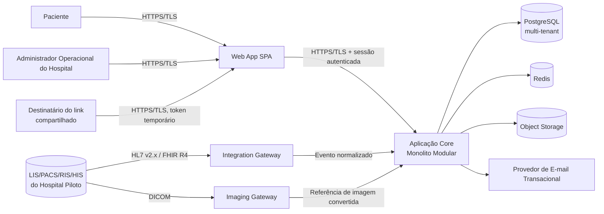
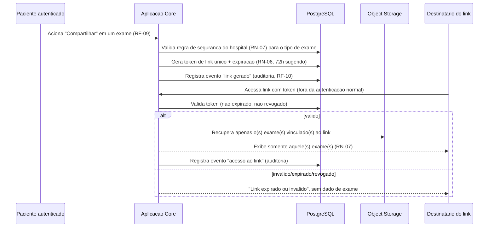
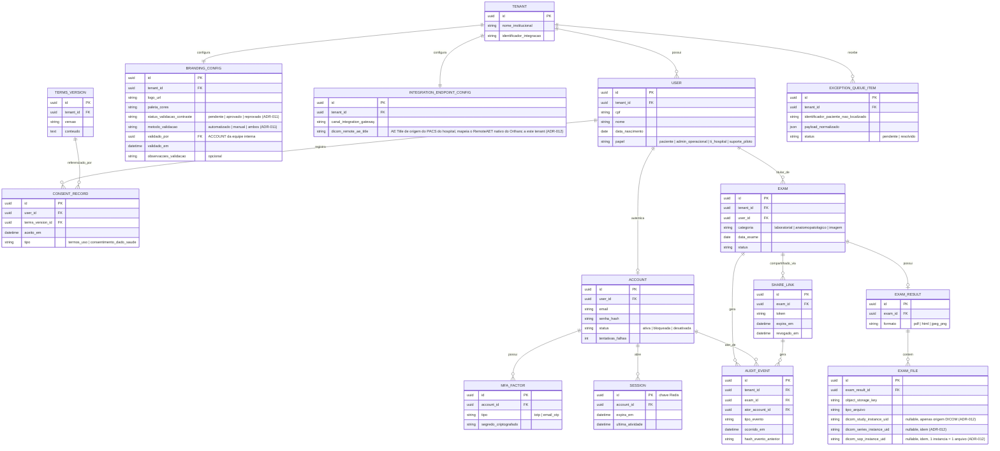

# SDD.md — Portal de Resultados de Exames (Aplicação White Label para Hospitais)

**Dono**: Software Architect
**Data**: 2026-09-02
**Status**: **Final** — Aprovado com ressalvas pelo CTO no Gate 2
(`CTO-REVIEW.md`, 2026-09-02). Alterações pontuais pós-Gate 2, decorrentes de
bloqueios reabertos via `BLOCKERS.md` (ex.: Bloqueio 001), são incorporadas
diretamente às seções afetadas, sem reabrir o Gate 2 inteiro — ver "Log de
Alterações Pós-Gate 2" ao final do documento. Histórico do Gate 2 original:
rascunho submetido ao CTO via `architecture-decision-review` +
`build-vs-buy-analysis` + `risk-and-compliance-check`, aprovado com ressalvas em
2026-09-02 — a partir daquele registro o `SDD.md` tornou-se final e UX/UI e Tech
Lead foram liberados para iniciar.
**Input**: `PRD-TECNICO.md` (liberado pelo Business Analyst, 2026-09-02) + `PRD.md`
(Seção 4.2, Premissas P9/P10) + `CTO-REVIEW.md` (Gate 1, Aprovado com ressalvas,
2026-09-02; Gate 2, Aprovado com ressalvas, 2026-09-02) + `BLOCKERS.md` (Bloqueio
001, reportado por `ux-ui`, resolvido — ver Seção 7.7 e Log de Alterações ao
final; Bloqueio 002, reportado por `tech-lead`, resolvido nesta atualização —
ver Seções 2.2, 5, 6.1 e Log de Alterações ao final)

> Três decisões desta arquitetura são marcadas explicitamente para
> `build-vs-buy-analysis`/`architecture-decision-review` no Gate 2, por exigência
> direta do `CTO-REVIEW.md` (Gate 1, ressalva 4) e do `PRD.md` (Seção 4.2/R4): (1)
> motor de integração LIS/PACS/RIS/HIS (ADR-002), (2) pipeline de imagens DICOM
> (ADR-003), (3) arquitetura de multi-tenancy/white-label (ADR-004). Uma quarta
> decisão (residência de dados, ADR-010) é marcada para `risk-and-compliance-check`
> por exigência de RNF-15. Todas as demais decisões de stack (ADR-001, 005-009) são
> escolhas de rotina do Software Architect, dentro da sua autoridade.

---

## 1. Visão Geral da Arquitetura

### 1.1 Contexto de negócio (resumo técnico)

Portal web white-label B2B2C: hospitais contratam a plataforma para oferecer aos
próprios pacientes um canal digital de consulta, download e compartilhamento
seguro de resultados de exame (laboratorial, anatomopatológico, imagem), sob a
marca do hospital, integrado ao(s) sistema(s) internos do hospital
(LIS/PACS/RIS/HIS). O MVP (Release 1) atende **um único hospital piloto**, ainda
não identificado (Premissa P1 do `PRD.md`) — a arquitetura é desenhada para não
exigir retrabalho estrutural quando hospital #2+ for integrado (Release 2,
RF-C01/RF-C02), conforme exigência explícita do Gate 1 do CTO.

### 1.2 Padrão arquitetural

**Monolito modular com serviços de borda especializados** (ver ADR-001). A
aplicação de negócio central roda como um único deploy (compatível com a
hipótese de squad pequena — 1 tech lead, 2 backend, 1-2 frontend, 1 QA — e o
prazo-alvo de 16-20 semanas do `PRD.md`, Premissa P3), organizada internamente em
módulos com fronteira de bounded context clara (DDD tático leve, via
`modular-design-principles`), prontos para extração futura como serviços
independentes sem redesenho de domínio. Dois subdomínios de interoperabilidade em
saúde — motor de integração HL7 v2.x/FHIR R4 (ADR-002) e pipeline de imagens
DICOM (ADR-003) — nascem como **serviços de borda separados**, apoiados em
produtos de mercado open-source, não construídos do zero dentro do monolito.

Este padrão foi escolhido em vez de microsserviços completos (overhead
operacional incompatível com a squad pequena) e em vez de monolito clássico sem
fronteira interna (contrariaria a exigência do `PRD.md`, Seção 4.2/R4, de não
gerar retrabalho ao escalar). Ver ADR-001 para o racional completo.

### 1.3 Camadas

1. **Apresentação**: Web App SPA responsivo (React/TypeScript — ver Seção 3),
   único canal de acesso do MVP (RNF-07; app nativo é Won't).
2. **Borda/API (BFF)**: ponto único de entrada autenticado, aplica RBAC (RNF-03),
   validação de sessão (ADR-007) e roteamento para os módulos de domínio.
3. **Domínio (monolito modular)**: módulos de negócio com fronteira de bounded
   context — ver Seção 2.
4. **Integração/Borda especializada**: Integration Gateway (HL7/FHIR, ADR-002) e
   Imaging Gateway (DICOM, ADR-003), ambos fora do processo do monolito core,
   comunicando-se com ele via API interna/eventos normalizados.
5. **Persistência**: PostgreSQL multi-tenant lógico (ADR-004, ADR-006), Redis
   (sessão/cache/fila, ADR-007), Object Storage (arquivos de laudo/imagem).
6. **Serviços externos**: provedor de e-mail transacional (RF-02, RF-03 fallback),
   sistemas do hospital piloto (LIS/PACS/RIS/HIS).

### 1.4 Diagrama de contexto (alto nível)



---

## 2. Componentes e Fluxo de Dados

### 2.1 Componentes (módulos do monolito core + serviços de borda)

Todo componente é rastreável a um ou mais RF do `PRD-TECNICO.md`.

| Componente | Tipo | Requisitos cobertos |
|---|---|---|
| Web App (SPA) | Apresentação | RF-01 a RF-13, RF-16 (toda a UI do paciente/admin) |
| API/BFF | Borda | Transversal — RBAC (RNF-03), validação de sessão (RF-04) |
| Identity & Access | Módulo de domínio | RF-01, RF-02, RF-03, RF-04, RN-03, RN-04 |
| Cadastro & Consentimento | Módulo de domínio | RF-12, RF-15, RN-01, RN-02, RN-14 |
| Catálogo de Exames | Módulo de domínio | RF-05 |
| Entrega de Laudo/Imagem | Módulo de domínio | RF-06, RF-07, RF-08 |
| Compartilhamento | Módulo de domínio | RF-09, RN-05, RN-06, RN-07 |
| Auditoria | Módulo de domínio | RF-10, RN-08, RNF-04 |
| Config de Tenant/Branding | Módulo de domínio | RF-11, RN-10, RNF-11, RN-09 |
| Gestão de Usuários (Admin) | Módulo de domínio | RF-13 |
| Ajuda/Suporte | Módulo de domínio | RF-16, RN-13 |
| Notificação | Módulo de domínio | RF-02 (e-mail), RF-03 (OTP e-mail), RF-09 (opcional) |
| Fila de Exceção | Módulo de domínio | RF-14 (paciente não localizado) |
| Integration Gateway | Serviço de borda (comprado, ADR-002) | RF-14, Seção 5.2 do PRD-TECNICO.md (LIS/RIS/HIS) |
| Imaging Gateway | Serviço de borda (comprado, ADR-003) | RF-07, RF-S02 (base futura), Seção 5.2 (PACS) |

### 2.2 Fluxo de dados — ingestão (push do hospital) e consulta (pull do paciente)

Reflete o fluxo de negócio já mapeado na Seção 4.6 do `PRD-TECNICO.md`, agora no
nível técnico (protocolo, componentes, tratamento de erro — decisão do Software
Architect, conforme nota daquela seção).

```mermaid
sequenceDiagram
    participant HIS as LIS/PACS/RIS/HIS (Hospital Piloto)
    participant IE as Integration Gateway (motor de mercado, ADR-002)
    participant ORT as Imaging Gateway (Orthanc, ADR-003)
    participant CORE as Aplicação Core (monolito modular)
    participant DB as PostgreSQL (tenant-scoped, RLS)
    participant OBJ as Object Storage
    participant PAC as Paciente (SPA)

    HIS->>IE: HL7 v2.x ORU^R01 / FHIR DiagnosticReport (laudo)
    HIS->>ORT: DICOM C-STORE (imagem; PACS do hospital conecta com AE Title de origem dedicado ao tenant, ADR-012)
    IE->>IE: Normaliza para formato canonico interno (JSON), Anti-Corruption Layer
    IE->>CORE: POST /internal/ingest (evento normalizado + tenant_id do hospital piloto)
    alt paciente localizado por identificador (CPF)
        CORE->>DB: Persiste exame vinculado ao paciente + tenant_id
    else paciente nao localizado
        CORE->>DB: Persiste em Fila de Excecao, aguardando cadastro/match futuro
    end
    IE-->>HIS: ACK (confirmacao de recebimento, quando aplicavel ao protocolo)
    ORT->>ORT: Converte DICOM para JPEG/PNG (pipeline assincrono)
    ORT->>OBJ: Armazena imagem convertida (mantem DICOM original no Orthanc)
    ORT->>CORE: Notifica conclusao da conversao (RemoteAET nativo do Orthanc + StudyInstanceUID/SeriesInstanceUID/SOPInstanceUID + referencia ao arquivo, ADR-012; Orthanc permanece agnostico de tenant)
    CORE->>DB: Resolve tenant_id via INTEGRATION_ENDPOINT_CONFIG.dicom_remote_ae_title == RemoteAET recebido (ADR-012)
    CORE->>DB: Persiste UIDs DICOM em EXAM_FILE + atualiza status do exame (imagem disponivel)
    PAC->>CORE: Login (RF-01) + MFA (RF-03)
    CORE->>REDIS: Cria sessao revogavel (ADR-007)
    PAC->>CORE: Consulta "Meus Exames" (RF-05)
    CORE->>DB: Query com tenant_id + patient_id (guard de aplicacao + RLS)
    CORE->>OBJ: Recupera laudo/imagem via URL assinada de curta duracao
    CORE-->>PAC: Exibe exame (RF-06/RF-07)
    CORE->>DB: Registra evento de auditoria (RF-10, append-only)
```

### 2.3 Fluxo de dados — compartilhamento por link temporário



### 2.4 Integrações externas mapeadas (Seção 5.2 do PRD-TECNICO.md)

| Integração | Componente responsável | Fronteira arquitetural |
|---|---|---|
| Sistema LIS (laudo laboratorial) | Integration Gateway (ADR-002) | HL7 v2.x MLLP / FHIR R4 (protocolo real a confirmar, P1) |
| Sistema PACS (imagem DICOM) | Imaging Gateway (ADR-003) | DICOM C-STORE / DICOMweb |
| Sistema RIS/HIS (dado cadastral/status) | Integration Gateway (ADR-002) | HL7 v2.x ADT/ORM / FHIR R4 Patient/ServiceRequest |
| Provedor de e-mail transacional | Módulo Notificação (adapter) | API HTTPS do provedor (abstraída por interface interna, sem lock-in de domínio) |
| Mecanismo de MFA (TOTP/OTP e-mail) | Módulo Identity & Access | Biblioteca RFC 6238 interna (ADR-008), não é integração externa |

---

## 3. Stack Tecnológica e Justificativa

| Componente | Tecnologia | Requisito que motiva | Alternativa considerada | Trade-off | ADR |
|---|---|---|---|---|---|
| Aplicação core (backend) | Node.js + TypeScript + NestJS | Prazo apertado (P3) + squad pequena + estrutura modular nativa (ADR-001) | Java + Spring Boot; Python + Django/FastAPI | Menor curva de aprendizado e tipos compartilhados com frontend vs. ecossistema Java mais maduro para saúde (mitigado por isolar HL7/FHIR/DICOM em serviços de borda) | ADR-005 |
| Frontend | React + TypeScript (SPA) | RNF-07 (web responsiva), RNF-06 (WCAG 2.1 AA — ecossistema maduro de componentes acessíveis) | Vue.js | React tem maior familiaridade de mercado/talento disponível; Vue teria curva de aprendizado similar sem ganho decisivo — escolha de rotina, sem ADR dedicado | — |
| Banco de dados primário | PostgreSQL (com RLS) | RNF-11/RN-09 (isolamento multi-tenant, ADR-004), RNF-02 (criptografia em repouso) | MySQL/MariaDB; MongoDB | RLS nativo decisivo para reforçar isolamento de tenant; MongoDB teria schema mais flexível para payload de integração, mas garantias de integridade mais fracas para RBAC/auditoria | ADR-006 |
| Sessão/cache/fila | Redis | RF-02/RF-04/RF-13 (revogação imediata de sessão, ADR-007); filas assíncronas (conversão de imagem, ingestão) | JWT stateless puro | Sessão revogável exige estado no servidor; ganho de simplicidade de revogação supera custo de dependência de disponibilidade do Redis | ADR-007 |
| Armazenamento de arquivo (laudo/imagem) | Object Storage compatível S3, criptografado (SSE-KMS), região Brasil | RNF-02 (criptografia em repouso), RF-08 (download), RF-09 (link temporário via URL assinada) | Armazenar BLOB diretamente no banco relacional | Object storage é o padrão de mercado para arquivo binário grande, com URL assinada de curta duração nativa para RF-08/RF-09; BLOB em banco degradaria performance de query e backup | — |
| Motor de integração LIS/RIS/HIS | Motor de interoperabilidade de mercado (ex.: NextGen Connect/Mirth Connect), open-source, com Anti-Corruption Layer | RF-14, Seção 5.2 do PRD-TECNICO.md | Construir parser HL7 v2.x/FHIR R4 próprio; SaaS de interoperabilidade de terceiro | Menor esforço/risco de prazo e sem lock-in de SaaS crítico, ao custo de mais um componente de infraestrutura a operar | **ADR-002 — marcado para `build-vs-buy-analysis`, Gate 2** |
| Pipeline de imagens médicas | Orthanc (servidor DICOM open-source) como gateway + conversão JPEG/PNG | RF-07, base para RF-S02 (Release 2) | Construir conversão DICOM do zero; SaaS de visualização/conversão DICOM de terceiro | Preparação para visualizador nativo sem retrabalho, ao custo de armazenar DICOM original desde já (storage antecipado) | **ADR-003 — marcado para `build-vs-buy-analysis`, Gate 2** |
| Isolamento multi-tenant | Lógico: `tenant_id` em toda entidade + Row-Level Security no PostgreSQL | RNF-11, RN-09 | Single-tenant com migração futura; multi-tenant físico (banco por hospital) | Evita migração de dado sensível em produção ao escalar, ao custo de esforço incremental no MVP e disciplina de engenharia rigorosa | **ADR-004 — marcado para `architecture-decision-review`, Gate 2** |
| MFA | TOTP (RFC 6238) + OTP por e-mail (fallback), sem SMS | RF-03, RN-03 | TOTP exclusivo; OTP por e-mail exclusivo | Cobre todo perfil sem exceção, sem custo recorrente de SMS, ao custo de fricção de onboarding do TOTP para parte do público | ADR-008 |
| Log de auditoria | Tabela PostgreSQL append-only, privilégio de banco restrito (sem GRANT UPDATE/DELETE), hash chain | RF-10, RN-08 | Append-only só por convenção de aplicação; serviço de log externo WORM | Defesa em profundidade sem custo de infraestrutura externa adicional no MVP | ADR-009 |
| Hospedagem/residência de dado | Região de nuvem localizada no Brasil (ex.: `sa-east-1`/equivalente) | RNF-15 | Região de nuvem fora do Brasil, com salvaguardas contratuais | Remove complexidade de transferência internacional de dado sensível, ao custo de menor opcionalidade futura de provedor/região | **ADR-010 — marcado para `risk-and-compliance-check`, Gate 2** |
| Padrão arquitetural geral | Monolito modular + serviços de borda especializados | Squad pequena + prazo apertado + necessidade de não retrabalhar ao escalar (R4) | Microsserviços completos; monolito clássico sem fronteira interna | Equilibra velocidade do MVP com extensibilidade futura, ao custo de disciplina de fronteira de módulo dentro do mesmo processo | ADR-001 |

---

## 4. Decisões Arquiteturais (índice de ADRs)

Toda decisão relevante está registrada como ADR imutável em `.md/adr/`. Este
índice reflete exatamente o estado atual dos arquivos — nenhum ADR listado aqui
sem arquivo correspondente, nenhum arquivo existente fora deste índice.

| ADR | Título | Status | Marcação para Gate 2 |
|---|---|---|---|
| [ADR-001](adr/001-monolito-modular-com-servicos-de-borda-especializados.md) | Adotar Monolito Modular com Serviços de Borda Especializados como Padrão Arquitetural | Accepted | Não (escolha de rotina) |
| [ADR-002](adr/002-motor-de-integracao-hl7-fhir-de-mercado.md) | Usar Motor de Interoperabilidade HL7/FHIR de Mercado, com Anti-Corruption Layer | Accepted | **Sim — `build-vs-buy-analysis`** |
| [ADR-003](adr/003-pipeline-de-imagens-medicas-dicom-com-gateway-de-mercado.md) | Usar Gateway DICOM de Mercado (Orthanc) para Conversão JPEG/PNG do MVP | Accepted | **Sim — `build-vs-buy-analysis`** |
| [ADR-004](adr/004-multi-tenancy-logica-desde-o-mvp.md) | Adotar Multi-Tenancy Lógica (tenant_id + RLS) desde o MVP | Accepted | **Sim — `architecture-decision-review`** |
| [ADR-005](adr/005-stack-core-nodejs-typescript-nestjs.md) | Usar Node.js + TypeScript + NestJS como Stack da Aplicação Core | Accepted | Não (escolha de rotina) |
| [ADR-006](adr/006-postgresql-como-banco-primario.md) | Usar PostgreSQL como Banco de Dados Primário | Accepted | Não (escolha de rotina) |
| [ADR-007](adr/007-sessao-server-side-revogavel-via-redis.md) | Usar Sessão Server-Side Revogável (Redis) em vez de JWT Stateless | Accepted | Não (escolha de rotina) |
| [ADR-008](adr/008-mfa-totp-e-otp-por-email-sem-sms.md) | Implementar MFA via TOTP (RFC 6238) e OTP por E-mail, sem SMS | Accepted | Não (escolha de rotina) |
| [ADR-009](adr/009-log-de-auditoria-imutavel-append-only.md) | Implementar Log de Auditoria Imutável como Tabela Append-Only com Hash Chain | Accepted | Não (escolha de rotina) |
| [ADR-010](adr/010-residencia-de-dados-em-regiao-de-nuvem-no-brasil.md) | Hospedar Dados em Região de Nuvem Localizada no Brasil | Accepted | **Sim — `risk-and-compliance-check`** |
| [ADR-011](adr/011-validacao-de-contraste-wcag-no-fluxo-de-configuracao-de-branding.md) | Validação de Contraste (WCAG 2.1 AA) como Gate Obrigatório no Fluxo de Configuração de `BRANDING_CONFIG` | Accepted | Não (resolução pontual de bloqueio pós-Gate 2, `BLOCKERS.md` Bloqueio 001 — ver Seção 7.7) |
| [ADR-012](adr/012-rastreabilidade-dicom-em-exam-file-e-resolucao-de-tenant-via-ae-title.md) | Rastreabilidade DICOM em `EXAM_FILE` e Resolução de `tenant_id` via AE Title Dedicado no Imaging Gateway | Accepted | Não (resolução pontual de bloqueio pós-Gate 2, `BLOCKERS.md` Bloqueio 002 — ver Seções 2.2 e 5) |

---

## 5. Modelo de Dados de Alto Nível

Entidades principais e relacionamentos (não é modelagem física detalhada — cabe
ao Backend Developer depois), derivados do fluxo de dados (Seção 2) e dos
requisitos do `PRD-TECNICO.md`. Toda entidade abaixo, exceto `Tenant`, carrega
`tenant_id` (ADR-004).



Notas:
- `AUDIT_EVENT.hash_evento_anterior` implementa a hash chain de ADR-009.
- `EXCEPTION_QUEUE_ITEM` implementa o requisito de RF-14 de não descartar
  registro não associável a paciente conhecido.
- `EXAM_FILE` mantém referência ao Object Storage, nunca o binário em banco.
- `BRANDING_CONFIG.status_validacao_contraste`, `metodo_validacao`,
  `validado_por`, `validado_em` e `observacoes_validacao` foram adicionados por
  ADR-011 (resolução do `BLOCKERS.md`, Bloqueio 001): nenhuma configuração de
  identidade visual de hospital pode ser considerada pronta para go-live
  enquanto `status_validacao_contraste != 'aprovado'` — detalhe completo do
  gate na Seção 7.7.
- `EXAM_FILE.dicom_study_instance_uid`/`dicom_series_instance_uid`/
  `dicom_sop_instance_uid` e `INTEGRATION_ENDPOINT_CONFIG.dicom_remote_ae_title`
  foram adicionados por ADR-012 (resolução do `BLOCKERS.md`, Bloqueio 002,
  reportado por `tech-lead`): fecham a lacuna de rastreabilidade entre
  `EXAM_FILE` e o recurso DICOM original no Orthanc (necessária para
  monitoramento por exame de RF-07/§6.1 e para RF-S02 reaproveitar o DICOM
  original sem retrabalho na Release 2, conforme ADR-003) e tornam explícita a
  forma como `tenant_id` chega ao ponto de notificação do Imaging Gateway
  (§2.2) — o Orthanc permanece agnóstico de tenant por natureza; é a
  Aplicação Core que resolve `tenant_id` casando o `RemoteAET` nativo do
  Orthanc (identifica a origem DICOM da associação) contra
  `INTEGRATION_ENDPOINT_CONFIG.dicom_remote_ae_title`, nunca por atribuição
  implícita/hardcoded. Detalhe completo da decisão em ADR-012.

---

## 6. Riscos Técnicos e Dívida Técnica Aceita

### 6.1 Riscos e gargalos

| Risco/Gargalo | Componente | Severidade | Mitigação ou plano |
|---|---|---|---|
| Indisponibilidade do provedor de e-mail bloqueia login para paciente sem TOTP configurado | Notificação / Identity & Access | Alta | RN-03 não permite bypass de MFA; mitigação parcial via TOTP como método primário (ADR-008); monitorar disponibilidade do provedor (RNF-10) e avaliar segundo provedor de fallback antes do go-live |
| Redis indisponível impede validação/criação de sessão para toda a base | Sessão (ADR-007) | Alta | Operar Redis gerenciado com replicação/failover automático; sem isso, todo o produto fica inacessível — condição de bloqueio de go-live a validar com DevOps |
| Integration Gateway como ponto único de falha da ingestão | Integration Gateway (ADR-002) | Média | RF-14 já exige que exames já sincronizados continuem disponíveis se a fonte cair — mitiga impacto ao paciente; operar a engine com redundância mínima (health check + restart automático) é responsabilidade do DevOps |
| Banco de dados único (PostgreSQL) sem redundância documentada ainda | PostgreSQL (ADR-006) | Alta | Exigir instância gerenciada com replicação síncrona/backup automatizado — detalhamento de infraestrutura real é do DevOps, mas o requisito de disponibilidade mínima nasce aqui |
| Erro de implementação (query sem filtro de tenant) causa vazamento de dado entre hospitais | Multi-tenancy lógica (ADR-004) | Alta | Guard de aplicação obrigatório em toda query + RLS como segunda camada + teste automatizado dedicado de vazamento cruzado — a ser formalizado como regra em `GUARDRAILS.md` pelo Tech Lead |
| Fila de exceção (pacientes não localizados) cresce sem monitoramento ativo | Fila de Exceção | Média | RF-14 já exige sinalização ao administrador/suporte; sem processo operacional definido, itens podem se acumular indefinidamente — condição de revisão: definir SLA operacional de triagem da fila junto ao hospital piloto real (P1) |
| Pipeline de conversão DICOM → JPEG/PNG falha isoladamente sem afetar o restante da lista de exames | Imaging Gateway (ADR-003) | Média | Já coberto pelo critério de aceite de RF-07 (não bloqueia o restante); requer monitoramento dedicado (RNF-10) por exame, não só por serviço — a correlação `EXAM_FILE` ↔ `StudyInstanceUID`/`SeriesInstanceUID`/`SOPInstanceUID` (ADR-012, resolução do `BLOCKERS.md` Bloqueio 002) é o que estruturalmente viabiliza esse monitoramento por exame, antes ausente do modelo de dados |
| Retenção do log de auditoria sem prazo definido pode crescer indefinidamente | Auditoria (ADR-009) | Baixa (operacional) / Média (compliance) | RNF-04 permanece "a confirmar" — job de arquivamento/purga só pode ser implementado após definição legal (CTO, Gate 2); sem prazo definido, tabela cresce sem limite conhecido |
| Prazo de ingestão fim-a-fim (hospital → portal) sem meta definida | Integration Gateway → Catálogo de Exames | Baixa (agora) / Média (ao confirmar P1) | RF-14 mantém prazo "a confirmar" dependente do protocolo real do piloto; revisitar quando P1 for resolvida |

### 6.2 Dívida técnica aceita conscientemente

| Dívida Técnica Aceita | Motivo | Condição de revisão |
|---|---|---|
| Sem escalabilidade horizontal multi-hospital configurada no MVP (apenas 1 instância lógica de tenant ativa) | `PRD.md` classifica escalabilidade horizontal multi-hospital como Won't para o MVP funcional — arquitetura já suporta múltiplos tenants logicamente (ADR-004), mas a infraestrutura de deploy real (auto-scaling, múltiplas réplicas) não é dimensionada para volume multi-hospital ainda | Revisitar quando hospital #2 for confirmado (Release 2, RF-C01/RF-C02) |
| Sem CDN para entrega de imagem/laudo no MVP | `PRD.md` classifica CDN como Could/Release 2 — benefício de performance só relevante em escala multi-hospital/multi-região | Revisitar se latência de download/visualização de imagem for reportada como problema pelo hospital piloto, ou ao escalar para múltiplas regiões |
| DICOM original armazenado no Orthanc, mas sem visualizador nativo (zoom/pan/window-level) exposto ao paciente no MVP | RF-07 corta para JPEG/PNG; RF-S02 (visualizador nativo) é Should/Release 2. A base já foi preparada (ADR-003) para não gerar retrabalho, mas a funcionalidade em si não é entregue agora | Revisitar quando RF-S02 for priorizado (Release 2), ou antes se Premissa P8 confirmar alto volume de imagem no hospital piloto real |
| Motor de integração configurado para um único canal (hospital piloto), sem abstração multi-hospital genérica ainda | RF-C02 (motor de integração genérico multi-LIS/PACS) é Could/Release 2 — só gera valor com hospital #2+; a ACL (ADR-002) já isola a complexidade de protocolo, mas a generalização de configuração multi-canal não foi construída agora | Revisitar ao integrar hospital #2 |
| Sem self-service de reset de MFA (RF-03) — depende de verificação manual via suporte | `PRD-TECNICO.md` já classifica isso como Release 2+; risco operacional aceito para o volume de 1 hospital piloto | Revisitar se volume de solicitações de suporte para reset de MFA se mostrar alto durante o piloto |
| Sem arquivamento/purga automatizado do log de auditoria | RNF-04 (prazo de retenção) permanece "a confirmar" — implementar purga sem definição legal seria arriscado (poderia descartar evidência exigida) | Implementar assim que o CTO/DevSecOps confirmar o prazo de retenção (Gate 2 / `compliance-validation`) |

---

## 7. Requisitos de Segurança e Compliance (nível de arquitetura)

> Esta seção define o **requisito de arquitetura** — autenticação, autorização,
> criptografia, isolamento — como insumo para o DevSecOps. Não substitui o
> SAST/DAST/hardening tático que o DevSecOps executará sobre o código depois, nem
> a análise estratégica de compliance do CTO (`risk-and-compliance-check`, Gate 2).

### 7.1 Autenticação

- **Usuário final (paciente/administrador/suporte)**: usuário/senha (RF-01) +
  MFA obrigatório sem exceção para todo perfil (RF-03, RN-03) — TOTP (RFC 6238)
  como método primário, OTP por e-mail como fallback, sem SMS (ADR-008).
- **Bloqueio por força bruta**: RN-04, limite de tentativas malsucedidas
  consecutivas (valor a confirmar, sugestão do BA: 5) antes de bloqueio
  temporário de conta.
- **Sessão**: server-side revogável via Redis (ADR-007), não JWT stateless —
  necessário porque RF-02/RF-04/RF-13 exigem revogação imediata (troca de
  senha, logout manual, desativação de conta administrativa). Expiração por
  inatividade (RF-04, valor a confirmar, sugestão do BA: 15 minutos).
- **Serviço a serviço (Integration Gateway/Imaging Gateway → aplicação core)**:
  autenticação via credencial de serviço dedicada (API key/mTLS interno, a
  detalhar na fase de implementação), nunca a mesma credencial de usuário
  final; canal interno não exposto à internet pública (ver 7.5).
- **Integração externa (hospital → Integration Gateway/Imaging Gateway)**:
  autenticação/autorização no nível do protocolo (ex.: canal MLLP dedicado por
  hospital, ou client TLS mútuo para FHIR R4/DICOMweb), configurada por tenant
  (`INTEGRATION_ENDPOINT_CONFIG`, Seção 5) — detalhe exato depende do protocolo
  real do hospital piloto (P1), a confirmar antes da configuração do canal
  real. Para o lado DICOM especificamente, cada tenant tem um AE Title de
  origem dedicado (`dicom_remote_ae_title`), usado pela Aplicação Core para
  resolver `tenant_id` a partir do `RemoteAET` nativo do Orthanc — o Orthanc em
  si permanece agnóstico de tenant, nunca atribuindo `tenant_id` de forma
  implícita/hardcoded (ADR-012, resolução do `BLOCKERS.md` Bloqueio 002).

### 7.2 Autorização

- **Modelo**: RBAC (RNF-03), com quatro papéis mínimos definidos no
  `PRD-TECNICO.md`: paciente, administrador operacional do hospital, equipe de
  TI do hospital, suporte técnico do piloto. Implementado via guards no
  BFF/aplicação core (ADR-005), nunca só validado no frontend.
- **Ownership**: paciente só acessa dado da própria conta (exames, histórico de
  auditoria, RF-05 a RF-10) — regra de ownership aplicada em toda query,
  independente do papel.
- **Escopo administrativo**: administrador operacional só gerencia contas do
  próprio hospital (RF-13, RN-09) — nunca de outro tenant, mesmo com papel
  administrativo válido.
- **Ação sensível exige permissão explícita**: desbloqueio/desativação de
  conta (RF-13), acesso ao painel de auditoria do hospital (RF-10) exigem papel
  administrativo — não disponível ao paciente comum.
- **Compartilhamento por link**: acesso do destinatário do link (RF-09) não
  passa pelo RBAC de usuário autenticado — é um escopo de autorização à parte,
  restrito ao(s) exame(s) especificamente vinculado(s) ao token (RN-07), nunca
  à conta completa do paciente.

### 7.3 Criptografia

- **Em trânsito**: TLS obrigatório em toda borda externa (SPA ↔ BFF, hospital
  ↔ Integration Gateway/Imaging Gateway, aplicação core ↔ provedor de e-mail),
  versão mínima recomendada TLS 1.2, com TLS 1.3 preferencial onde suportado
  pelo protocolo do hospital piloto (RNF-01; versão final a confirmar com
  DevSecOps).
- **Em repouso**: dado de saúde (laudo, imagem, dado cadastral) criptografado
  em repouso (RNF-02) em duas camadas — criptografia de disco gerenciada pelo
  provedor de nuvem (banco, object storage) + criptografia de coluna via
  `pgcrypto` para identificadores de paciente mais sensíveis (ex.: CPF) no
  PostgreSQL (ADR-006). Gestão de chave via KMS do provedor de nuvem escolhido
  (detalhe operacional do DevOps).
- **Arquivo de laudo/imagem**: acesso exclusivamente via URL assinada de curta
  duração (Object Storage), nunca URL pública permanente — cobre tanto
  download (RF-08) quanto exibição via compartilhamento (RF-09, escopo
  adicional de token de aplicação sobre a URL assinada, RN-06/RN-07).

### 7.4 Isolamento Multi-Tenant

- **Aplicável** — modelo de negócio é B2B2C multi-hospital (RNF-11, RN-09).
- Isolamento **lógico**: toda entidade de domínio carrega `tenant_id`
  (Seção 5); nenhuma query executa sem contexto de tenant explícito (guard de
  aplicação obrigatório); Row-Level Security no PostgreSQL como segunda camada
  de defesa (ADR-004, ADR-006).
- Cobre todos os tipos de dado exigidos pelo `PRD-TECNICO.md`: cadastral
  (`USER`), exame (`EXAM`/`EXAM_RESULT`/`EXAM_FILE`), auditoria
  (`AUDIT_EVENT`), configuração visual (`BRANDING_CONFIG`).
- Teste automatizado de vazamento cruzado entre tenants é requisito
  obrigatório de QA/CI (a ser formalizado pelo Tech Lead em `GUARDRAILS.md`),
  não coberto só pela existência do RLS.

### 7.5 Superfície de Exposição

| Componente | Exposição | Requisito mínimo de proteção |
|---|---|---|
| Web App (SPA) | Pública (internet) | TLS, cabeçalhos de segurança (CSP, HSTS), WAF na borda |
| API/BFF | Pública (internet), atrás do mesmo domínio da SPA | TLS, RBAC, rate limiting (reforça RN-04), WAF |
| Integration Gateway | Rede privada/VPN dedicada ao canal do hospital piloto, **não exposto à internet pública em geral** | mTLS ou canal dedicado por hospital, restrito por IP/VPN quando o protocolo permitir |
| Imaging Gateway (Orthanc) | Rede privada, acessível apenas pela aplicação core e pelo canal DICOM do hospital | Sem exposição pública direta do endpoint DICOMweb no MVP; acesso mediado pela aplicação core |
| PostgreSQL / Redis / Object Storage | Rede privada apenas | Sem exposição pública direta; acesso só pela aplicação core, credenciais gerenciadas via secret manager (detalhe do DevOps) |

### 7.6 Consentimento e conformidade LGPD (suporte de arquitetura)

- `CONSENT_RECORD` (Seção 5) grava versão do texto aceito, data/hora e
  titular, de forma auditável e recuperável (RF-12) — nunca sobrescrito
  (mesma garantia de imutabilidade de `AUDIT_EVENT`, ADR-009, aplicável aqui
  por design de tabela append-only equivalente).
- Consentimento específico de dado de saúde é campo/registro **separado** do
  aceite geral dos Termos de Uso (RN-02, LGPD Art. 11, I) — nunca um único
  campo booleano combinado.
- Direitos do titular (acesso, correção, eliminação) suportados no MVP via
  canal de suporte (RF-16), não self-service — arquitetura não impõe barreira
  técnica a atender essas solicitações manualmente (dado é consultável por
  identificador de titular em todas as tabelas relevantes).
- Aprofundamento formal de DPIA, termo específico do hospital e fluxo com DPO
  próprio do hospital permanece pendente do `risk-and-compliance-check` do
  CTO (Gate 2) e do `compliance-validation` do DevSecOps mais adiante — esta
  seção fornece a base de arquitetura, não a análise de compliance completa.

### 7.7 Validação de Contraste (WCAG 2.1 AA) na Configuração de `BRANDING_CONFIG`

> Adicionado nesta atualização pós-Gate 2, em resolução ao `BLOCKERS.md`
> (Bloqueio 001, reportado por `ux-ui`) — decisão completa registrada em
> **ADR-011**.

- **Lacuna resolvida**: RNF-06 (WCAG 2.1 AA, Must-have inegociável) já é
  garantido no nível de **componente** pela regra de contraste dinâmico do
  `UX-SPEC.md` (Seção 3.3) — mas nenhum ponto do `SDD.md` cobria o cenário em
  que o **próprio ativo de marca fornecido pelo hospital** (ex.: logo com
  texto de baixo contraste embutido na imagem) viola WCAG de forma que a
  regra de componente não alcança, já que o problema está no conteúdo do
  arquivo, não em como o sistema o renderiza.
- **Gate obrigatório de configuração**: nenhuma configuração de
  `BRANDING_CONFIG` (Seção 5) pode ser considerada pronta para o go-live de um
  hospital enquanto `status_validacao_contraste != 'aprovado'` — regra
  aplicada pelo módulo Config de Tenant/Branding (Seção 2.1), não apenas
  processo operacional informal.
- **Checagem automatizada (paleta)**: a `paleta_cores` de cada
  `BRANDING_CONFIG` é validada por um utilitário determinístico (fórmula de
  contraste do WCAG 2.1) contra os tokens fixos do sistema (Camada 2,
  `UX-SPEC.md` §3.3), executado pela equipe interna no momento da
  configuração — não é um serviço novo exposto, nem self-service do hospital
  (consistente com RN-10).
- **Checagem manual obrigatória (logo)**: como `logo_url` é uma imagem
  arbitrária fornecida pelo hospital, validar texto embutido nela por
  automação exigiria análise de imagem/OCR — custo desproporcional ao volume
  do MVP (ADR-011). Em vez disso, um membro da equipe interna realiza revisão
  visual obrigatória do logo antes da aprovação; essa etapa **não é
  opcional** mesmo quando a checagem automatizada de paleta passa.
- **Rastreabilidade**: `validado_por`, `validado_em`, `metodo_validacao` e
  `observacoes_validacao` (Seção 5) registram quem validou, quando e como —
  evidência auditável de conformidade a RNF-06 por configuração de hospital,
  não só por lançamento de release.
- **Fora do escopo desta etapa**: esta validação cobre apenas o requisito de
  contraste (RNF-06) sobre o ativo de marca em si; não substitui SAST/DAST/
  hardening tático do DevSecOps, nem qualquer outra checagem de qualidade de
  imagem (resolução, formato) fora do escopo de acessibilidade.

---

## Checklist de Critérios de Pronto (Software Architect)

- [x] Toda decisão arquitetural relevante tem ADR correspondente em `.md/adr/`
      (12 ADRs, ver Seção 4 — ADR-011 e ADR-012 adicionados pós-Gate 2 em
      resolução aos Bloqueios 001 e 002 do `BLOCKERS.md`, respectivamente)
- [x] Toda escolha de stack tem justificativa e trade-off/alternativa
      considerada registrados (Seção 3)
- [x] Todo risco técnico/gargalo tem severidade; toda dívida técnica aceita
      conscientemente tem o motivo registrado (Seção 6)
- [x] Requisitos de segurança cobrem autenticação, autorização, criptografia e
      isolamento — nenhum item genérico sem detalhe concreto (Seção 7)
- [x] Nenhuma das 7 seções está vazia ou com placeholder

**Três decisões (ADR-002, ADR-003, ADR-004) estão explicitamente marcadas para
`build-vs-buy-analysis`/`architecture-decision-review`, e uma (ADR-010) para
`risk-and-compliance-check`, no Gate 2 do CTO — conforme exigência do
`CTO-REVIEW.md` (Gate 1, ressalva 4) e do `PRD.md` (Seção 4.2/R4, Premissas
P9/P10). Nenhum requisito do `PRD-TECNICO.md` foi considerado tecnicamente
inviável ou desproporcional em custo/prazo — nenhuma entrada em `BLOCKERS.md`
foi necessária nesta submissão.**

**Veredito do Software Architect**: rascunho do SDD.md submetido e aprovado com
ressalvas pelo CTO no Gate 2 (`CTO-REVIEW.md`, 2026-09-02) — documento final a
partir daquele registro. Alterações pontuais posteriores estão listadas no log
abaixo, sem reabrir o Gate 2 inteiro.

---

## Log de Alterações Pós-Gate 2

| Data | Origem | Seção(ões) alterada(s) | Mudança | Motivo |
|---|---|---|---|---|
| 2026-09-02 | `BLOCKERS.md`, Bloqueio 001 (reportado por `ux-ui`) | §4 (índice de ADRs), §5 (`BRANDING_CONFIG`), §7.7 (nova) | Adicionado ADR-011 e gate obrigatório de validação de contraste (WCAG 2.1 AA) — automatizado para paleta, manual para logo — como pré-requisito de aceite de `BRANDING_CONFIG` antes do go-live de cada hospital; novos campos `status_validacao_contraste`, `metodo_validacao`, `validado_por`, `validado_em`, `observacoes_validacao` na entidade | RNF-06 é Must-have inegociável; a regra de contraste dinâmico de componente (`UX-SPEC.md` §3.3) não cobria texto de baixo contraste embutido em logo fornecido pelo hospital — lacuna de processo, não de componente, identificada pelo UX/UI |
| 2026-09-02 | `BLOCKERS.md`, Bloqueio 002 (reportado por `tech-lead`) | §2.2 (diagrama de sequência de ingestão), §4 (índice de ADRs), §5 (`EXAM_FILE`, `INTEGRATION_ENDPOINT_CONFIG`), §6.1 (risco do pipeline DICOM), §7.1 (autenticação de integração externa) | Adicionado ADR-012: (a) `EXAM_FILE` ganha `dicom_study_instance_uid`, `dicom_series_instance_uid`, `dicom_sop_instance_uid` para rastreabilidade ao recurso original no Orthanc; (b) `INTEGRATION_ENDPOINT_CONFIG` ganha `dicom_remote_ae_title` (AE Title de origem do PACS por tenant); (c) diagrama de sequência §2.2 tornado explícito — Orthanc permanece agnóstico de tenant e apenas propaga o `RemoteAET` nativo + UIDs DICOM; a Aplicação Core resolve `tenant_id` casando esse `RemoteAET` contra `INTEGRATION_ENDPOINT_CONFIG.dicom_remote_ae_title`, nunca por atribuição implícita/hardcoded | Lacuna estrutural identificada pelo Tech Lead na decomposição do `TASK.md` (BE-07, BE-22): sem correlação DICOM explícita, o "monitoramento dedicado por exame" de RF-07/§6.1 e o reaproveitamento do DICOM original por RF-S02 (Release 2, conforme justificativa de ADR-003) ficavam sem suporte estrutural no modelo de dados; sem campo equivalente ao `canal_integration_gateway` para o lado DICOM, a atribuição de `tenant_id` a eventos do Imaging Gateway ficava implícita, violando a regra de multi-tenancy do `TASK.md` (Seção 1.3) |
